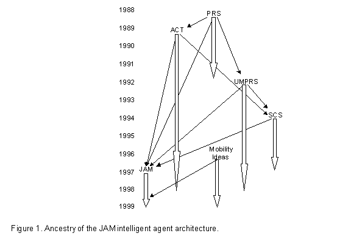
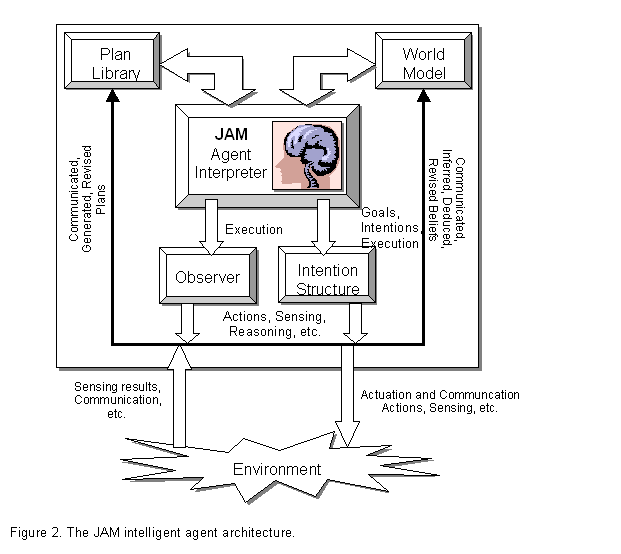
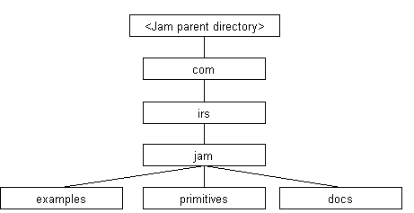
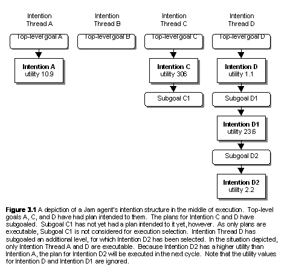

    Usage Manual for the Jam! Agent Architecture

JAM Agents in a Nutshell

Version 0.65+0.76i [\[1\]](#_ftn1)

(November 2001)

Marcus J. Huber, Ph.D.

[marcush@home.com](mailto:marcush@home.com)

Intelligent Reasoning Systems

Oceanside, California

[http://members.home.net/marcush/IRS](http://members.home.net/marcush/IRS)

Draft of November 1, 2001

Table of Contents
=================

Table of Contents............................................................................................................................................ 2

1.INTRODUCTION & BACKGROUND......................................................................................................... 4

1.1. Overview.............................................................................................................................................. 5

1.2. Unpacking the JAM Agent distribution.............................................................................. 6

1.3. Running and building JAM......................................................................................................... 7

2.BELIEFS............................................................................................................................................................ 9

3.GOALS............................................................................................................................................................. 11

3.1. Top-level Goals............................................................................................................................. 11

3.2. Subgoals............................................................................................................................................ 12

4.PLANS.............................................................................................................................................................. 14

4.1. Expressions...................................................................................................................................... 14

4.2. Plan Body.......................................................................................................................................... 16

4.2.1.Plan Variables.................................................................................................................................. 18

4.2.2.Plan Actions...................................................................................................................................... 18

4.2.3.Plan Comments................................................................................................................................. 30

4.3. Plan Name.......................................................................................................................................... 30

4.4. Plan Documentation.................................................................................................................. 30

4.5. Plan Execution Behavior......................................................................................................... 30

4.5.1.Plan Goal.......................................................................................................................................... 31

4.5.2.Plan Conclude.................................................................................................................................. 31

4.6. Plan Context................................................................................................................................... 31

4.6.1. Predicates.............................................................................................................................................. 33

4.7. Plan Precondition....................................................................................................................... 34

4.8. Plan Utility...................................................................................................................................... 34

4.9. Plan Attributes.............................................................................................................................. 34

4.10. Plan Effects..................................................................................................................................... 35

4.11. Plan Failure..................................................................................................................................... 35

5.CYCLIC FUNCTIONALITY........................................................................................................................ 38

6.INTENTION STRUCTURE.......................................................................................................................... 39

7.SOURCE-CODE API..................................................................................................................................... 40

8.PRIMITIVE FUNCTION INTERFACING................................................................................................ 42

8.1. PrimitiveAction Interface....................................................................................................... 42

8.2. UserFunctions.java..................................................................................................................... 44

8.3. Invoking Legacy Code................................................................................................................ 46

8.4. Predefined Functions................................................................................................................ 46

9.THE INTERPRETER.................................................................................................................................... 57

10.CHECKPOINTING and MOBILITY.................................................................................................. 61

10.1. Checkpointing................................................................................................................................ 61

10.2. Mobility.............................................................................................................................................. 61

11.KNOWN BUGS AND LIMITATIONS................................................................................................... 63

12.EXAMPLE PLANS................................................................................................................................... 64

blocks-world.jam...................................................................................................................................... 64

ex1.jam............................................................................................................................................................... 64

ex2.jam............................................................................................................................................................... 64

ex3.jam............................................................................................................................................................... 64

ex4.jam............................................................................................................................................................... 64

ex5.jam............................................................................................................................................................... 64

ex6.jam............................................................................................................................................................... 65

ex6b.jam............................................................................................................................................................. 65

ex7.jam............................................................................................................................................................... 65

ex8.jam............................................................................................................................................................... 65

ex9.jam............................................................................................................................................................... 65

exA.jam............................................................................................................................................................... 65

exB.jam............................................................................................................................................................... 65

exC.jam............................................................................................................................................................... 65

exD.jam............................................................................................................................................................... 66

exE.jam............................................................................................................................................................... 66

exF.jam............................................................................................................................................................... 66

exG.jam............................................................................................................................................................... 66

exH.jam............................................................................................................................................................... 66

exI.jam................................................................................................................................................................ 66

exJ.jam................................................................................................................................................................ 66

parseString.jam............................................................................................................................................ 66

sockets-client.jam..................................................................................................................................... 66

sockets-client2.jam................................................................................................................................... 66

sockets-server.jam.................................................................................................................................... 67

sockets-server2.jam.................................................................................................................................. 67

13.JAM BNF Grammar............................................................................................................................ 68

14.Comparison to UMPRS................................................................................................................... 71

Similarities...................................................................................................................................................... 71

Differences..................................................................................................................................................... 71

15.REFERENCES.......................................................................................................................................... 72

16.  ACKNOWLEDGEMENTS ...................................................................................................................... 74

  

INTRODUCTION & BACKGROUND
=========================

JAM is an intelligent agent architecture that grew out of academic research and extended during the last five years of use, development, and application. JAM combines the best aspects of several leading-edge agent theories and intelligent agent frameworks. Influences upon JAM include:

*   The Belief-Desire-Intention (BDI) theories \[Bratman88:Plans, Georgeff, etc.\]
*   The intelligent agent architectures of the Procedural Reasoning System (PRS) of Georgeff, Lansky, Rao, and others (see \[Georgeff86:Procedural, Georgeff87:Reactive, Ingrand90:Managing, Ingrand92:Architecture\])
*   The University of Michigan 's implementation of PRS called UMPRS \[Lee94:UMPRS, Huber93:UMPRS\]
*   SRI International's PRS-CL \[Myers97:User\]
*   SRI International's ACT plan interlingua \[Wilkins95:Common, Myers97a:Act, Myers97b:Act\]
*   The Structured Circuit Semantics (SCS) representation of Lee and Durfee \[Lee94:Structured, Lee97:Explicit\]
*   Mobility aspects from Agent Tcl \[Gray97:Agent\], Agents for Remote Action (ARA) \[Peine97:ARA\], Aglets \[Lange98:Programming\] and others.

  
JAM's family tree is illustrated below in Figure 1, where the small arrows indicate derivation and the large arrows indicate approximate development period.

1.1. Overview
-------------

Each JAM agent is composed of five primary components: a _world model_, a _plan library_, an _interpreter_, an _intention structure_, and an _observer_. This is illustrated in Figure 2. The world model is a database that represents the beliefs of the agent. The plan library is a collection of plans that the agent can use to achieve its goals. The interpreter is the agent's "brains" that reason about what the agent should do and when it should do it. The intention structure is an internal model of the goals and activities the agent currently has and keeps track of progress the agent has made toward accomplishing those goals. The observer is a lightweight plan that the agent executes between plan steps in order to perform functionality outside of the scope of its normal goal/plan-based reasoning (e.g., buffer incoming messages).

  
The JAM execution semantics and behavior is a combination of that of UMPRS and SCS. Changes to the world model or posting of new goals triggers reasoning to search for plans that might be applied to the situation (this list of plans is called the Applicable Plan List, or APL). The JAM interpreter selects [\[2\]](#_ftn2) one plan from this list of applicable plans and _intends_ it (i.e., commits itself to execute the plan). The act of intending the plan places the now-instantiated plan (it has, at this point, a variable binding specific to the current situation) onto the agent's _intention structure_, the agent's multiple-goal runtime stack. The agent may or may not immediately execute the newly intended plan, depending upon the plan's utility relative to that of intentions already on the intention structure. We discuss this in more depth later in this manual.

The agent developer deals explicitly with the world model, the plan library, the observer, and specification of the agent's initial goals. In addition to the primary components describe above, there exists a function library and interface for specifying and performing low-level, non-decomposable "primitive" functions. This document describes the theory behind each component, how the components interact, important representations and semantics, and any files that are necessary. Samples of files specifying plans, goals, beliefs, and observer procedures are included with the JAM distribution. Before continuing, we describe how to unpack the files in the JAM agent's distribution and then how to compile and execute a JAM agent.

1.2. Unpacking the JAM Agent distribution
-----------------------------------------

The first step in building agents is to extract the various files from the downloaded file. The download file is in the form of a zip file, which is a compressed collection of all of the JAM files. A utility such as Winzip, unzip, or PKUnzip is necessary to extract the files. The figure below illustrates the directory structure that is required and used by JAM.

  
Locate or create a directory in which to uncompress and extract the distribution (<Jam parent directory> in the figure above) and the directories indicated above will be created. The primary JAM source code is located in the jam directory. This directory also contains several files that are helpful in building a JAM agent, such as make.bat and Makefile, and a todo file that contains a long list of ideas concerning extensions and modifications to the JAM agent architecture. The examples directory contains a number of agent specification files (the files with the .jam extension) that serve both as examples to programmers as well as a source of regression tests. [\[3\]](#_ftn3)  The primitives directory contains source code for primitive function definitions that implement the PrimitiveFunction interface (see Section 8). Finally, the JAM manual and class documentation (javadoc) can be found in the docs directory.

1.3. Running and building JAM
-----------------------------

JAM agents can be invoked soon after the downloaded file is uncompressed as described above. As with all Java applications, the CLASSPATH variable must first be set appropriately. For JAM, this means that the file jam.jar be added to the CLASSPATH definition. The jam.jar file can be found in the jam directory in the figure above. Other Java development environments typically require the equivalent operation to be performed. If the class files from compiling the Java source code are to be used instead then the head of the JAM distribution (<Jam parent directory> in the figure above) needs to be added to the CLASSPATH definition rather than the JAR file.

JAM agents can be invoked from a command prompt (and via a couple of methods in the JAM class, described later). The DOS and Unix command prompt lines for doing this have the form:

 java com.irs.jam.JAM <jam-options> <jam-files>

where <jam-files> represents a list of one or more files containing the agents plan library, goal list, Observer definition, and initial world model. The "com.irs.jam" prefix is required because JAM has been defined to be in the com.irs.jam Java package. Any of the .jam files in the examples directory can be used right after JAM has been unpacked from the distributed download file.

Following are two examples of JAM agent invocation:

 java com.irs.jam.JAM -w -g examples/blocks-world.jam

java com.irs.jam.JAM basic.jam examples/relations.jam

The first step JAM performs when invoked is to parse the text from the agent specification file(s) and create internal representations for this information before proceeding with execution. If there are any parsing problems, JAM will indicate this with appropriate error messages and will abort execution. If parsing was successful, JAM will begin to execute plans until the agent achieves all of its goals.

JAM recognizes the following runtime options:

\-i : show changes to the intention structure (e.g., whenever a goal fails and is removed).

\-g : show changes to the agent's goal list (e.g., when a plan establishes a subgoal).

\-f : display the file name and line number of actions that fail

\-p : specifies a string, rather than a file, to be parsed into the agent's plans, goals, and/or world model. Any number of -p arguments may be used on a command line. Note that this is a new use of the -p runtime option.

\-a : show Applicable Plan List generation and selection information.

\-s : same as –a above.

\-w : show the world model whenever a change occurs to the world model (e.g., when a new element is added to the agent's beliefs).

Warning: Use of the -i, -g, -a, -s, , -f and -w flags results in copious amounts of information being displayed!

The JAM architecture currently compiles a number of statistics during execution and prints out the final statistics once it completes its execution. The runtime statistics gathered are: the number of goals that the agent achieved; the number of cycles through the interpreter; the total number of Applicable Plan Lists (APLs) created (includes concrete-level APLS, metalevel APLS, and null APLs); and the number of null APLs generated.

The JAM agent can be built from the included Java source code by using the included Makefile file (for Unix-based systems), and makep.bat and make.bat files (for DOS systems). For Unix, simply go to the JAM core directory (<JAM parent directory>/com/irs/jam) and type 'make' at the command line prompt. For DOS systems, go to the JAM core directory and type 'make' at the command line prompt. In case these make files do not work in your environment, it is a simple process to build the JAM agent manually. To compile all of the Java source code, use the command:

javac \*.java

in the JAM installation directory as well as the primitives and examples subdirectories. For Integrated Development Environments, the typical steps are to create a new project and then include all of the Java files in the JAM installation directory as well as all the Java files in the primitives and examples subdirectories.

The JavaCC program is required if you wish to modify the JAM parser (to add or remove constructs, change keywords or syntax, etc., all of which are done in the JAMParser.jj file). JavaCC is _not_ necessary if you wish to use JAM as downloaded. However, JavaCC must be run whenever any modification to the JAMParser.jj file is made. The command to do this is:

javacc JAMParser.jj.

For DOS systems, the batch file makep.bat is provided so that all you need to do is type 'makep' at the command line prompt (and then make in order to compile the resulting parser-related Java files). Nothing special needs to be done for Unix systems as the Makefile provided should invoke JavaCC (and the javac) appropriately. After successfully performing the JavaCC command.

Building an application using the JAM architecture consists of extending JAM low-level functionality by writing appropriate primitive functions in Java and then specifying agent behavior by writing plans, an initial world model, initial top-level goals, and an Observer procedure if that is required. Once the primitive functions are written, the agent is built and invoked as above.

**2\.** **BELIEFS**
===================

The JAM agent's World Model holds the facts that the agent uses to represent the current state of the world. Information that might be kept there includes state variables, sensory information, conclusions from deduction or inferencing, modeling information about other agents, etc. Each world model entry is a simple proposition of the form:

**relation\_name**  _argument1 argument2 ... argumentN;_

The ordering, semantics, and typing of the arguments is unconstrained and is determined by the programmer. [\[4\]](#_ftn4) For example, a relation with the name **tree** might specify the height, species, and color of a tree, such as in:

**tree** _20 "Maple" "Red";_

with the implicit parameter ordering of height (using an integer), then species (using a string), then color (using another string). Because the order is unconstrained by JAM, the programmer is free to specify this information in a different order and with different argument types, as in:

**tree** 123 _"maple" 20;_

which has an implicit parameter ordering of color (using an integer this time), then species (using a string), then height (using an integer). The order and content of a world model relation is therefore completely up to the discretion and control of the programmer and the JAM parser does not perform any consistency checking.

World model relation's arguments are currently limited to the following types: strings (represented internally as a Java String), floating point numbers (represented internally as doubles), integer numbers (represented internally as longs), and native Java objects.

Specification of an agent's initial world model consists of creating a text file containing the keyword "FACTS:" followed by the list of world model relations. The agent parses the world model specification before execution begins. A simple example world model specification, drawn from a robotics application, might be as shown below:

FACTS:

 FACT robot\_status "Ok";

 FACT partner\_status "Ok";

 FACT robot\_initialized "False";

 FACT robot\_localized "False";

 FACT robot\_registered "False";

 FACT robot\_position 10000 10000 0;

 FACT robot\_location "Unknown";

 FACT self " CARMEL ";

 FACT partner "BORIS";

 FACT object\_found "False";

 FACT object\_delivered "False";

 FACT communication\_status "Ok";

 FACT plan\_empty "False";

 FACT destination "Room4";

 FACT next\_room "Room3";

 FACT next\_node "Node12";

A JAM agent manipulates and queries the World Model using a number of actions available for use in plans. Actions are available for putting entries onto the World Model (assert), removing entries from the World Model (retract), revising information already on the World Model (update), and two forms of queries (fact and retrieve). We describe these actions in full detail later in Section 4 but we will give a few examples of how they can be used.

As an example, consider the robotics World Model specified above. If the agent uses its vision system to acquire the scene in front of it, it can add this to its explicit knowledge by using the following action (where $scene represents a variable containing the image and $pose represents the robotic agent's current pose):

**ASSERT** _scene $scene $pose;_

The robot can later remove this fact using one of the following actions (the second one removes all World Model entries with the relation name of _scene_):

**RETRACT** _scene $scene $pose;_

 or

**RETRACT** _scene;_

The robot can "remember" what its current destination is by using the following action, where the value of the `$dest` variable will be set to "Room4":

**RETRIEVE** _destination $dest;_

The FACT action can be used in the same manner as the retrieve action above as long as the `$dest` variable does not already have a value. Variables with bound values are not changed but are used to restrict matching to only those World Model entries that have a matching parameter. In the following example, the fact action will return that it failed to find a match if the $dest variable has any value other than "Room4".

**FACT** _destination $dest;_

If the agent takes a new image, it can revise its knowledge in place rather than retracting and then asserting it. The agent can do this using the following action:

**UPDATE** (scene $scene $pose) (scene $new\_scene $new\_pose)_;_

In the update action, the first parenthetical grouping specifies a World Model pattern to match and replace with the contents of the second parenthetical grouping.

The examples above are just to give a taste of how an agent uses its World Model. We describe all of these actions and others in more detail in Section 8.

**3\.** **GOALS**
=================

A JAM agent's top-down behavior is invoked by specifying goals that the agent is to achieve, perform, or maintain. All goals are given to the agent in a text form with the following syntax:

goal\_type _goal\_name parameter1 ... parameterN <:UTILITY expression>_;  
  

goal\_type is one of: achieve, perform, maintain, query. The goal\_name is a relation label identifying a goal's name, while the parameter arguments are the goal relation's values. The :utility keyword and expression are optional and provide an opportunity to specify a numeric value or calculation that specifies the goal's utility to the agent.

A JAM agent may have a (possibly large) number of alternative plans for accomplishing a single goal. It is JAM's built in capability to reason about the alternatives, to select the best alternative given the particular situation, and to switch between alternative goals as utilities for doing each goal change, that are some of its strongest advantages over standard programming paradigms. The agent checks all the plans that can be applied to the goal are checked to see if any of them are relevant to the current situation by filtering out plans based upon their precondition and context fields. Those plans that _are_ applicable are collected into what is called the Applicable Plan List (APL - called the Set Of Applicable Plans, or SOAK, in PRS terminology). A utility value is determined for each plan in the APL and the highest utility plan is selected and _intended_ to the goal. If the intended goal has the highest utility among all goals with intentions, then its plan is executed. Otherwise, a previous intention still has a higher utility and _that_ plan is executed. As the utilities of the various goals change as the situation changes, the agent will switch between goals in order to continually pursue the highest-priority goal.

An agent's goals can be divided into two categories: top-level goals and subgoals. The description of goals above applies to both top-level goals and subgoals. We'll discuss each of these categories in more detail below and describe how the two categories differ.

3.1. Top-level Goals
--------------------

Top-level goals are the highest-level goals that the agent has. Top-level goals are specified to the agent by using the keyword "goals:" and then a list of goal specifications in the form specified above. A simple example of a top-level goal specification for an agent might be:

GOALS:

 ACHIEVE robotics\_demo\_completed :UTILITY 10;

 MAINTAIN obstacles\_avoided;

Top-level goal specifications are usually given to the agent within a file specified as a command-line argument (see Section 8), can be communicated to one agent from another agent and parseed (see Section 4.2.2) by the receiving agent, or by many other means. The key is that the top-level goals must be specified in a text format as described above so that the agent can parse and internalize them. When adding top-level goals in this manner, where the agent parses a text specification, the goal parameters may only contain constant values (integers, floating-point numbers, or strings) as there are no variable bindings yet to establish values for any variables if they were to be used.

A final method for adding top-level goals is to use the post action within plans (see Section 4.2.2). When using the post action, a single top-level goal can be directly added to the agent's intention structure. When adding top-level goals using a post action, where the agent is in the middle of executing a plan, the goal parameters may contain constant values _and_ variables. In this case, there _may_ be values bound to variables by the time the post action is reached (actually, some variables may not have values bound to them, but this is dependent upon the agent programmer and is allowed by the JAM architecture).

Top level goals are _persistent_. That is, they are pursued until they are satisfied (by successful plan execution or opportunistically by some other means, such as another agent) or are removed explicitly using an unpost action (see Section 4.2.2) within a plan. In other words, if a plan for a top-level goal fails, then the agent removes its commitment to that goal by removing its _intention_ (the instantiated plan), but leaves the goal on the intention structure. As will be seen in the next section, subgoals are not persistent by default. With this operationalization of top-level goals, agent have a low level of commitment to all top-level goals, and a strong level of commitment to goals that have intentions associated with them (which is consistent with, for example \[Cohen87:Intention\]).

3.2. Subgoals
-------------

  
Subgoals are goals that the agent creates from within plans during plan execution. The achieve, perform, maintain, and query actions are used in plans (see Section 4.2.2) to invoke subgoaling. APL generation is performed and an intention is found and intended to a subgoal just as for top-level goals. Subgoaling can be performed to arbitrary depth levels and can be _recursive_, where a plan for a particular goal can subgoal to the same goal.

When subgoaling is used within plans, the utility of the lowest subgoal is used to determine the overall utility of what we call the _intention thread_. Switching between highest-utility intentions, therefore, happens due to consideration of the utility of the "leaf" goals within an intention thread. This is illustrated in the Figure 3.1, where utility calculations of non-leaf intentions are ignored for selection purposes.

A further difference between subgoals and top-level goals is that subgoals are _not_ persistent by default. If a plan fails for a subgoal, the subgoaling action is considered to have failed as if it were any other type of valid plan action. The failure semantics of plans is discussed in detail in Section 4.2.

**4\.** **PLANS**
=================

A _plan_ defines a procedural specification for accomplishing a goal. Its applicability is limited to a particular _goal_ or data-driven _conclusion_, and may be further constrained to a certain _precondition_ and maintained _context_. The procedure to follow in order to accomplish the goal is given in the plan's procedural _body_. Each plan has a unique _name_ that can be used to distinguish between procedures. Each plan has an explicitly or implicitly (i.e., default) defined _utility_ calculation, which is used to influence selection of certain procedures over others through the default utility-based metalevel reasoning mechanism of JAM. Another optional component is the _effects_ field, which is identical in syntax to a plan's procedural body, but which is executed when the plan completes successfully and is used to perform World Model updating similar to add/delete list attribute in STRIPS plans \[Fikes71:STRIPS\]. A procedural specification of what the agent should do when a plan fails can be represented in a plan's optional _failure_ section. Another component of a plan is an optional _documentation_ section, which provides a generic place for the programmer to put commentary related to the plan as a whole. The final possible field that can be defined for a plan is an _attributes_ field, which provides a place for a programmer to put information concerning plan characteristics that can be reasoned about during plan execution and/or metalevel reasoning.

The basic structure of a JAM plan is shown below (optional fields are surrounded with the "<" and ">" symbols):

Plan:

{

 GOAL: \[goal specification\]

 OR

 CONCLUDE: \[world model relation\]

 NAME: \[string\]

 BODY: \[procedure\]

 <DOCUMENTATION: \[string\]>

 <PRECONDITION: \[expression\]>

 <CONTEXT: \[expression\]>

 <UTILITY: \[numeric expression\]>

 <FAILURE: \[non-subgoaling procedure\]>

 <EFFECTS: \[non-subgoaling procedure\]>

 <ATTRIBUTES: \[string\]>

}

Each of the sections of a plan is described below in more detail. Before this, though, we discuss _expressions_, an important JAM representational building block.

4.1. Expressions
----------------

Expressions are used in a number of places within JAM. By definition, all of JAM's _values_ and _variables_ are expressions. A value may be an integer, a floating point number, a string, or a Java Object. JAM and user-defined primitive functions are also considered expressions.

The syntax of function expressions within JAM plans follows the Lisp function format closely, where the first element is the function to perform while the remaining elements are arguments to the function, all enclosed within parenthesis. For example, (+ 3 1) adds the numbers 3 and 1 together, while (> $x 5) returns a Boolean value True  if the variable $x  is greater than 5, and False  if it is less than or equal to 5.

User-defined functions can be used in expressions in the same manner as built-in expressions. For example, if you have developed a new primitive function called `equals` that compares two objects and returns True when the objects are equal and False otherwise, it may be used as follows:

WHEN : TEST (equals $obj1 $obj2) {

 // Process equal objects

};

This support extends even to "legacy" Java code that needs JAM's Java reflection capabilities. For example, if the equals primitive is defined in the Java class com.foo.bar.UserClass, the following form is acceptable (and must be used in this case):

WHEN : TEST (&& (!= $obj1 0)

 (!= $obj2 0)

 (com.foo.bar.UserClass.equals $obj1 $obj2)) {

 // Process non-null, equal objects

};

The following table lists the built-in JAM functions.

**Function**

**Description**

**Function**

**Description**

**\-**

**Subtraction**

**+**

**Addition or Concatenation**

**\***

**Multiplication**

**/**

**Division**

**%**

**Modulo**

**abs**

**Absolute Value**

**&&**

**Conjunction**

**||**

**Disjunction**

**!=**

**Inequality**

**\==**

**Equality**

**\>**

**Greater-than**

**\>=**

**Greater or Equal**

**<**

**Less-than**

**<=**

**Less or Equal**

**!**

**Negation**

Note that many functions allow mixed (i.e., integer and floating point) number operations. Boolean conditionals, however, cannot have mixed argument types, in general. It is illegal, for example, to compare a string with an integer. A special allowance has been made for comparing Java objects, where the expressions `(== $obj 0)` and `(!= $obj 0)` can be used to determine whether a variable holding a Java object (`$obj` in the example) is null or not null.

    
Some examples of valid expressions are shown below.

Furthermore, most functions can have single or multiple arguments, and quite often more than two arguments. Semantics for expressions with more than two arguments, such as in the ">" example above, is defined such that the relation must hold between the first argument and each of the rest of the arguments. In the ">" case, the value of the `$a` variable must be greater than 10 _and_ the value of `$b` _and_ the value of `$c` to return `True`. For arithmetic functions, the function is applied to each of the arguments. For the "/" example, 30 is divided first by 2.0, then by 3, and finally by -4.

4.2.   Plan Body
----------------

The body of a plan describes the sequence of actions, a procedure, to be taken in order to accomplish a goal. The body may contain JAM-provided actions, JAM-provided primitive functions, and user-defined primitive functions, and can be organized into any of a number of different constructs (described shortly). A plan executes until it reaches the end of its encoded procedure. The plan is also considered to have completed successfully if the plan is an ACHIEVE or MAINTAIN goal and the goal expression becomes true during the middle of execution of the body.

A plan body will fail if an action within the body fails and there are no alternative paths to procedure completion. For example, a plan body with a simple sequence of actions will fail if any action in the sequence fails (this applies to subgoal actions such as achieve and perform as well). Branch constructs such as or and do\_any can be used to provide alternate execution paths to protect against action failure.

An example of a plan is shown below: [\[5\]](#_ftn5)

`Plan: { NAME: "Example plan" DOCUMENTATION: "This is a nonsensical plan that shows all of the possible actions" GOAL: ACHIEVE plan_example $distance; PRECONDITION: (< $distance 50); CONTEXT: RETRIEVE task_complete $STATUS; (== $STATUS “False”); BODY: QUERY determine_task $task; FACT problem_solved $task $solved; OR { TEST (== $solved "YES"); WAIT user_notified; RETRACT working_on_problem "True"; } { TEST (== $solved "NO"); ACHIEVE problem_decomposed; ATOMIC { ASSERT working_on_problem "True"; MAINTAIN problem_decomposed; }; ASSIGN $result (* 3 5); }; UPDATE (task_complete) (task_complete "True"); FAILURE: UPDATE (plan_example_failed) (plan_example_failed "True"); EXECUTE print "Example failed. Bailing out" ATTRIBUTES: "test 1 cpu-use 3.0"; EFFECTS: UPDATE (task_complete) (task_complete “True”); }`

Note that JAM (and even its precursor, UMPRS) use structure programming constructs in contrast with previous instantiations of PRS (e.g., PRS-CL and PRS-Lite), which allow unstructured procedures (i.e., procedures with the equivalent of "goto" actions.)

### 4.2.1.   Plan Variables

Variables are represented in plans by a symbolic identifier preceded by a "**$"** symbol. In the example plan in the section above, variables are used in the GOAL, PRECONDITION, and BODY fields. The variables referenced in the GOAL field of a plan are bound from a parent or top-level goal. If the plan is invoked through subgoaling from a parent plan, modification of the variable's value is reflected in the variable binding in the parent plan. In this manner, parameters can be passed to and returned from subgoals. In the example above, the variable `$distance` is used in the precondition expression to constrain the plans initial condition to only those situations where the value of the variable is less than 50. Another variable is used in the context field of the plan, where the value of the $STATUS variable is set as a result of the retrieve action searching through the agent's World Model and finding a match. In the line following the retrieve, the $STATUS variable's value is compared to the string "False".

Other than those variables referenced in the GOAL field and in subgoal actions, which are bound to parent and subgoaled plans, respectively, variables used in a plan are local to a plan instance. That is, each APL element has its own internal table for keeping track of the plan's variables and their values. It is quite common to have an APL with multiple elements formed from the same plan with different variable bindings (e.g., based upon different World Model entries). What this means is that if more than one instance of a plan is being executed simultaneously [\[6\]](#_ftn6), changes to the variables in one plan do not affect the values of variables in the other plan.

Variables within a JAM agent's plans can have values of Java Long integers, Java Double floating points, Java Strings, or arbitrary Java objects. JAM supports many natural operations with the numeric and string types, such as arithmetic and string concatenation, respectively (see above for complete details), and can parse these types from text files such as those created for the agent's plans and initial world model.

Java objects are handled internally using references to instances of the Java Object class and are not currently parsable from text files. Java objects must be created and returned by primitive functions. Variables holding these objects can then be passed as arguments to other primitive actions or subgoals and can even be saved and retrieved to and from the agent's World Model. Manipulation of the objects' inherent functionality from the plan level is currently very limited, however, and must generally be performed within primitive actions. See the definition of the execute action in the following section for details on how some methods may be invoked directly from the plan level.

### 4.2.2.   Plan Actions

Actions within plans can be simple, directly specifying a function to perform, or a complex construct containing one or more actions and constructs within it. For simplicity, we call both actions although it should be pretty clear when reading through the descriptions of the implemented actions which are simple functions and which are constructs.

There are a large number of predefined JAM actions, all of which are characterized by being written in uppercase letters in plans. Each action in a plan can specify a goal or condition to ACHIEVE, WAIT for, MAINTAIN, or QUERY. In addition, a plan action can be any of the following: a low-level primitive function to EXECUTE directly, an ASSERTion of a fact to the world model, a RETRACTion of a fact from the world model, an UPDATE of a fact in the world model, a FACT or a RETRIEVE statement that retrieves relation values from the world model, or an ASSIGN statement that assigns variables the results of run-time computations. Furthermore, iteration, branching, and parallel execution are accomplished through while, do-while, or, and, do\_all, do\_any, when, and parallel constructs. For convenience when testing plan failure behavior (or for other reasons) there is also a fail action which is an action that always fails. An example of quite a few of these actions is included in the example plan above. Each of the supported actions is listed in the table below and is described in more detail in alphabetical order after the table.

**Action**

**Description**

**Action**

**Description**

**ACHIEVE**

Subgoal

**AND**

Do all branches; try in order

**ASSERT**

Add to world model

**ASSIGN**

Set variable value

**ATOMIC**

Perform without interruption

**DO-WHILE**

Iterate

**DO\_ALL**

Do all branches in random order

**DO\_ANY**

Do one random branch

**EXECUTE**

Perform primitive action

**FACT**

Check world model values

**FAIL**

Unconditionally fail

**LOAD**

Parse JAM input file

**MAINTAIN**

Subgoal

**NEXTFACT**

Get the next matching world model relation retrieved with RETRIEVALL

**OR**

Do any branch; try in order

**PARALLEL**

Execute all branches simultaneously

**PERFORM**

Subgoal

**POST**

Add top-level goal

**QUERY**

Subgoal

**RETRACT**

Remove from world model

**RETRIEVE**

Get values from world model

**RETRIEVALL**

Get all matching world model relations

**SUCCEED**

Unconditionally succeed

**TEST**

Check condition

**UNPOST**

Remove goal

**UPDATE**

Change world model

**WAIT**

Wait for condition/goal

**WHEN**

Conditional execution

**WHILE**

Iterate

**ACHIEVE** _goal\_name parameter1 parameter2 ... parameterN :UTILITY expression_;  
An achieve action causes the agent to establish a goal achievement subgoal for the currently executing plan. This then triggers the agent to search for plans in the plan library that can satisfy the goal _goal\_name_ given the current context. [\[7\]](#_ftn7)  Parameters can be used as arguments to the goal to be achieved and can also be used to get return values back from the invoked plan. If the invoked plan fails and the goal was specified as a subgoal of a plan, then the achieve action fails with ramifications identical to the failure semantics as for any other plan body action that fails. The failure semantics for top-level goals is different, however, and is explained in Section 3.

An achieve action can optionally specify the utility of the goal using the keyword :UTILITY _expression_ after the parameters. If the utility is not specified, it has the default utility 0.0. The details of how the goal utility is interpreted will be explained in Sections 9, but in general it is combined additively with a plan's priority to calculate the overall priority of an executing plan.

achieve subgoals differ from perform subgoals (described below) in several important aspects.

1. The agent checks to see whether the subgoal has already been accomplished before generating an APL. If the goal has been accomplished, the plan does not subgoal; it just succeeds. If the goal has not been accomplished, the plan does subgoal.

2. The agent only considers plans that have achieve goal specifications during generation of the applicable plan list (APL). This means that plans with perform goal specifications will not be executed for an achieve goal.

3. The agent continually monitors for goal achievement. Typically, the plan selected for the subgoal will be the means by which the subgoal is accomplished. However, if the agent detects (opportunistic) accomplishment of the goal (perhaps by another agent), it will consider the subgoal action successful and discontinue execution of the plan established to achieve the subgoal.

4. If the plan selected for accomplishment of the achieve goal completes successfully, the agent will assert a relation to the world model. The world model entry asserted is the goal specification for the goal just achieved. For example, the first achieve example below would cause JAM to assert the fact **robot\_homed $x $y $orient** for the appropriate grounded values of the variables.

Note that the JAM achieve action differs from the UMPRS version of the achieve action in that UMPRS does not have goal achievement semantics and is therefore like JAM's perform action.

Examples of ACHIEVE actions are shown below:

Example:  **ACHIEVE robot\_homed $x $y $orient;**

Example: **ACHIEVE robot\_homed $x $y $orient :UTILITY (+$x $y 10);**

**AND** { _action-sequence1_ } _..._ { _action-sequenceN_ };  
where each _action-sequence_ (also called a _branch_) is one or more of any of the actions or constructs listed here and _N_ > 0. The semantics of an and action is that the interpreter will execute each of the branches in turn (based on the order in which they appear in the plan definition file), with the first branch in the plan executed first. If all of the branches succeed, then the and action succeeds. If any branch fails, then the entire and action fails. [\[8\]](#_ftn8)

Example: `AND { ACHIEVE moved_to $x $y; } { ACHIEVE moved_to $x $y; };`

**ASSERT** _relation\_name argument1 argument2 ... argumentN;_  
Information is placed into the world model using an assert action. Assertion causes the agent to search the world model for the given relation name. If it finds a world model entry with the same relation name and the same argument values, the action does nothing. Otherwise, the action _appends_ the asserted fact, with all of the arguments evaluated into concrete values, onto the world model. This action always succeeds.

Example: **ASSERT goal\_in\_view "True";**

NOTE: To _modify_ a relation in the world model, use the update action, described below.

**ASSIGN** _variable expression_;  
Variables can be assigned values using the ASSIGN action. The given expression is evaluated and the variable is assigned the resulting string, floating-point number, integer number, or Java Object. This action always succeeds.

Example: **ASSIGN $diff (- $x2 $x1);**

**ATOMIC** {_action1; action2; ... actionN_; )

The sequence of actions _action1, action2, ... actionN_ are all executed before control is given back to the interpreter. Normally, the interpreter performs several functions between each action (see Section 8.) This might, in some cases, cause the agent to interrupt execution of a sequence of actions in the middle of the sequence. Using the ATOMIC action bypasses this interpreter activity, guaranteeing that the sequence of actions will complete. The ATOMIC action succeeds when the entire sequence executes successfully, and fails if the sequence fails.

Example:

** ATOMIC**

** {**

** UPDATE (debug\_mode) (debug\_mode "False");**

** UPDATE (run\_mode) (run\_mode "True");**

** EXECUTE print "Now entering run mode.\\n";**

** };**

**DO** { _action1; action2; ... actionN_; } **WHILE** : _action0_;

The sequence of actions _action1, action2, ... actionN_ are executed (N > 0) and then, if _action0_ (typically a TEST action) succeeds, the sequence of actions are repeated. This continues until _action0_ fails, and the action after the DO is then executed, or until one of _action1, action2,... actionN_ fails, whereby the entire DO action fails.

Example: `DO { EXECUTE print $x; ASSIGN $x (+ $x 1); } WHILE : TEST (< $x 10);`

**DO\_ALL** { _action-sequence1_ } _..._ { _action-sequenceN_ };  
where each _action-sequence_ (also called a _branch_) is one or more of any of the actions or constructs listed here, and _N_ > 0. The semantics of a do\_all action is that the interpreter will execute the branches in random order. If all of the branches succeed, then the do\_all action succeeds. If any branch fails, then the do\_all action fails.

Example:

** DO\_ALL**

** {**

** ACHIEVE moved\_to $x $y $orientation;**

** }**

** {**

** ACHIEVE moved\_to $x $y $orientation;**

** };**

**DO\_ANY** { _action-sequence1_ } _..._ { _action-sequenceN_ };  
where each _action-sequence_ (also called a _branch_) is one or more of any of the actions or constructs listed here, and _N_ > 0. The semantics of a do\_any action is that the agent will execute the branches in random order. If any one of the branches succeed, then the do\_any action succeeds. If all branches fail, then the do\_any action fails.

Example:

** DO\_ANY**

** {**

** ACHIEVE retrieved\_bid "Agent1";**

** }**

** {**

** ACHIEVE retrieved\_bid "Agent2";**

** };**

**EXECUTE** _function\_name parameter1 parameter2 ... parameterN;_  
**EXECUTE** _class\_name._execute _parameter1 parameter2 ... parameterN;_  
**EXECUTE** _class\_name.function\_name parameter1 parameter2 ... parameterN;_  
**EXECUTE** _class\_name.function\_name_\[_object\_ref_\] _parameter1 parameter2 ... parameterN;_  
Primitive functions are executed by using an execute action. Primitive functions implement the lowest-level (i.e., "native code") functionality of an agent and therefore are where all the "real" work is done by the agent-based application. Certain general-purpose primitive functions, such as printing out textual information, are already implemented and are provided as part of the JAM distribution. We describe these in Section 8.4. Most application-specific primitive functionality will need to be programmed by an agent programmer, and we describe how to do this in detail in Section 8. We have tried to support a wide range of implementation and invocation paradigms so the execute action has a number of different syntaxes and semantics. In particular, there are three syntactic forms of the execute action (of the four forms listed above, the second and third share the same syntax) that have four distinct semantic behaviors.

Primitive function parameters can be used for input only, output only, and both input and output of values between a plan and native Java code.

The first semantic form of the execute action is used to perform primitive functions that are encoded in the UserFunctions.java file that comes with the JAM source code distribution. An agent programmer can add code to this UserFunctions class to perform whatever functionality is required. The primary advantages of this form are that the reflection capabilities are not required and that it results in relatively terse plan lines since class paths (see below) do not need to be used to specify the function to perform. The primary disadvantage is that JAM architectural source code must be modified.

The second semantic form of the execute action is used to invoke a member function of a Java class and the class implements the PrimitiveAction interface. The JAM interpreter dynamically loads and creates an object of the specified class using the Java reflection package (which uses the default constructor for the class). The interpreter then searches for a member function with a matching method name (in this case, it will always be execute because the specified class implements the PrimitiveAction interface). Note that this form of execute does not require, nor does it permit, specification of a particular object instance upon which to invoke the method. The primary advantage of using this form is the ability to write new classes that do not interfere with JAM source code.

The third semantic form of the execute action is used to invoke a member function of a Java class and the class _does not_ implement the PrimitiveAction interface (e.g., some pre-existing Java class). In this case the JAM interpreter again dynamically loads and creates an object of the specified class using the Java reflection package (which uses the default constructor for the class). The interpreter then searches for a member function with a matching method name. Note that this form of execute does not require, nor does it permit, specification of a particular object instance upon which to invoke the method. This form operates as if the functionality invoked is a Java static method. Argument types must match for the search to be successful (i.e., an Integer object or an int will match a JAM ValueLong; a Float, Double, float, or double will match a JAM ValueReal; a string will match a ValueString; and basically anything else will match a ValueObject). The primary advantage of using this form is the ability to invoke legacy functionality without having to add any special "wrapper" code. The primary disadvantage of this form is that atomic bidirection parameters (i.e., int, long, float, double) are not currently supported (i.e., arguments that are modified are not reflected back to the agent's plan level). Objects that are modified are correctly reflected back to the plan level.

The fourth semantic form of the execute action provides the ability to invoke a method on a Java object. Reflection is performed only to match the method's name and parameter types and then the method is invoked on the specified object. The primary advantage of using this form is the ability to invoke legacy functionality without having to add any special "wrapper" code. The primary disadvantage of this form is that this form also has the same limitations with bidirection atomic parameters as the third form. Examples of each of the forms of execute are shown below.

Example of invoking a primitive function defined in UserFunctions.java:

Example: **EXECUTE process\_image $img $num\_objs $objlist;**

Example of invoking a primitive function defined in the class RoboticImage that implements the PrimitiveAction interface:

Example: **EXECUTE com.irs.util.RoboticImage.execute $img $num\_objs $objlist;**

Example of invoking a method (processImage) of a "legacy" class (RoboticImage) as a primitive function:

Example: **EXECUTE com.irs.util.RoboticImage.processImage $img $num\_objs $objlist;**

Example of invoking a method (processImage) on an instance of a "legacy" class (whatever $img is) as a primitive function:

Example: **EXECUTE processImage\[$img\] $num\_objs $objlist;**

**FACT** _relation\_name argument1 argument2 ... argumentN;_  
Information from the world model can be accessed using the fact action. The world model is searched for the first entry with the given relation name that has matching constant and variable values. Any arguments that are unbound variables are assigned the appropriate values from the matched world model entry. If no match is found, the fact action fails.

Example: **FACT robot\_location $x $y $orient;**

**FAIL**;This action _always_ fails. It can be used to explicitly cause a branch or a plan to fail without having to resort to some more obscure, implicit method.

FAIL;

**LOAD** _file\_list_

This action provides the functionality of bringing in additional plans, goals, world model facts, etc. from a file during execution, where file\_list  is a list of filenames to load and parse. This is not yet implemented in JAM (it is functionality provided by UMPRS that we will implement soon).

Example: **LOAD " file1.jam " " file2.jam " " file3.jam ";**

**MAINTAIN** _goal\_name parameter1 parameter2 ... parameterN;_  
A maintain goal indicates that the specified goal must be reattained if it ever becomes unsatisfied. A maintain goal is very similar to an achieve goal except that a maintain goal is never removed from the agent's goal list automatically. The only way that a maintain goal is removed from the agent's intention structure is to perform an explicit unpost action (see below) within a plan or Observer definition. A maintain goal only make sense as a top-level goal of an agent.

Example: **MAINTAIN objects\_avoided;**

**NEXTFACT** _variable relation\_name argument1 argument2 ... argumentN;  
_The nextfact action retrieves the next world model relation from the set retrieved using a prior retrieveall action. The arguments to nextfact are a variable and a world model relation. The retrieveall action stores the list of world model matches for the relation specified in a variable and it is this variable that should be used in _variable_ (the first argument above). Each call to nextfact changes the variables in the argument list of the world model relation specified to the next match found in the world model. This action succeeds when another matching world model relation is found and fails when no further world model matches could be made.

Example**:** **NEXTFACT $onfacts ON $blockA $blockB;**

**OR** { _action\_sequence1_} ... { _action\_sequenceN_ };  
where _action\_sequence_ (also called a _branch_) is one or more of any of the actions listed here, and _N_ > 0. The semantics of an OR action is that the agent will execute each of the branches in turn, with the first branch in the plan executed first. If any of the branches succeed, then the or action succeeds. If all branches fail, then the or action fails.

Example:

**OR**

**{**

**TEST (< $z 0);**

**EXECUTE print " Error: altitude value < 0!\\n ";**

**}**

**{**

**TEST (>= $z 0);**

**ASSIGN $altitude $z;**

**};**

**PARALLEL** { _action\_sequence1_ } _..._ { _action\_sequenceN_ };  
**NOTE:** The parallel action no longer works quite as specified below since the advent of Java 2 and seems to vary in behavior depending upon computing architecture. Use with caution.

For the parallel action, _action\_sequence_ (also called a _branch_) is one or more of any of the actions allowed within JAM plans, and _N_ > 0. The semantics of a parallel action is that the interpreter will execute each of the branches simultaneously using separate threads. Precisely, the first action of each branch is executed in parallel, then the second action of each branch is executed in parallel, etc. (as long as there are actions in the branch, of course). This lock-step parallelism preserves the execution semantics of interleaving action execution with Observer and interpreter execution. If all of the branches succeed, then the parallel action succeeds. If any branch fails, then the parallel action fails.

Example:

**EXECUTE create\_proposal $proposal;**

**PARALLEL**

**{**

**EXECUTE send\_proposal $proposal " Agent1 ";**

**}**

**{**

**EXECUTE send\_proposal $proposal " Agent2 ";**

**};**

**PERFORM** _goal\_name parameter1 parameter2 ... parameterN :UTILITY expression_;  
An perform action causes the agent to establish a behavior performance subgoal for the currently executing plan. This then triggers reasoning to search for plans in the plan library that can satisfy the goal _goal\_name_ given the current context.[\[9\]](#_ftn9) Parameters can be used as arguments to the goal to be performed and may also be used to get return values back from the invoked plan. If the invoked plan fails, and the perform action was within a plan body, the perform action fails as would any other plan body action. The failure semantics for top-level goals is different, however, and is explained in Section 3.

A perform action can optionally specify the utility of the goal using the keyword :utility _expression_ after the parameters. If the utility is not specified, it has the default utility 0.0. The details of how the goal utility is interpreted will be explained in Section 9, but in general, it is combined additively with a plan's priority to calculate the overall priority of an executing plan.

perform subgoals differ from achieve subgoals (described above) in several important aspects.

1.  The agent does not check to see whether the subgoal has already been accomplished before generating an APL. An APL will be generated even if the agent's world model indicates that a goal with the same specification has already been achieved.
2.  The agent considers plans that have ACHIEVE goal specifications as well as plans that have PERFORM goal specifications during generation of the applicable plan list (APL). This means that plans with an ACHIEVE goal specifications may be executed for a PERFORM goal.
3.  The agent does not monitor for goal achievement during plan execution. The plan selected for the PERFORM goal, whether the plan's goal specification is PERFORM or ACHIEVE, will execute until the plan succeeds or fails.
4.  An assertion to the world model entry that the goal has been achieved is only performed if the plan has an ACHIEVE goal specification and the plan selected for accomplishment of the PERFORM subgoal completes successfully. There is no assertion to the world model if the plan selected for accomplishment of the PERFORM subgoal completes successfully and the plan has a PERFORM goal specification.

Example: **`PERFORM process_incoming_bids $BIDS $AGENTS;`**

**POST**   _goal\_expr;_  
The post action has the effect of adding a top-level goal (i.e., a goal that has no parent goal) to the agent's intention structure. The goal expression `goal_expr` is a standard ACHIEVE, PERFORM, QUERY, or MAINTAIN plan action consisting of the goal type, goal name, goal arguments, and the optional utility expression.

Examples:

`POST ACHIEVE robot_homed $x $y $orient :UTILITY (+ $x $y 10);`

`POST PERFORM process_incoming_bids $BIDS $AGENTS;`

**QUERY** _goal\_name parameter1 parameter2 ... parameterN;_  
A query action is functionally identical to an achieve action. It is provided to allow the programmer to be more explicit about the semantics of the action's goal (information acquisition, in particular). If the invoked plan fails, the query action fails.

Example: **`QUERY vision_processe_list;`**

**RETRACT** _relation\_name argument1 argument2 ... argumentN_;  
One or more entries in the world model can be removed from the database using a retract action. The agent searches the world model for all entries with the given name, _and the given parameter values_, and removes them if any exist. If the arguments do not match, then effectively no action is taken. This action never fails.

Example: `RETRACT goal_in_view " True ";`

**RETRIEVE** _relation\_name argument1 argument2 ... argumentN;  
_Information from the world model can be accessed using the retrieve action. The retrieve action gets values from the world model for the variable arguments regardless of the current value of the variables. Like the fact action, this action searches for the first world model entry, in this case matching only against the relation name. This action should be used carefully because the variable arguments will likely be overwritten with new values. This action succeeds if there is an entry with the given relation name in the world model, and fails otherwise.

Example: `RETRIEVE robot_location $x $y $orient;`

**RETRIEVEALL** _variable relation\_name argument1 argument2 ... argumentN;  
_Information from the world model can be accessed using the RETRIEVEALLaction. The arguments to RETRIEVEALL are a variable and a world model relation. The RETRIEVEALL action is similar to RETRIEVE but gets _all_ values from the world model (at the time of the call) for the world model relation specified and stores the list of matches in _variable_. This action is intended for use with the NEXTFACT action (see above), which can iterate through the world model relation matches. This action always succeeds.

Example: `RETRIEVEALL $onfacts ON $blockA $blockB;`

**SUCCEED**;  
This action _always_ succeeds. It can be used to explicitly indicate that a branch should succeed (e.g., in a " try-catch " OR construct) without having to resort to some more obscure, implicit method.

Example: `SUCCEED;`

**TEST** _expression_;

The action succeeds if the expression evaluates to true, otherwise it fails. Note that an expression is considered to be true if it returns _Value.TRUE_, a non-zero integer or floating-point value, a non-empty string (i.e., length greater than zero), or a non-null Object.

Example: **TEST (== $x $y);**

**UNPOST** _goal\_expr;_  
The unpost action looks through the agent's goal list for the goal specified in goal\_expr. If it finds the goal, and the goal is not currently being pursued, it simply removes the goal from the agent's intention structure. However, if a plan for the goal _is_ being executed, the goal is not immediately removed. The goal will be removed when the agent's interpreter tries to execute the goal's next plan action. This will result in the goal and all of its subgoals being removed from the agent's intention structure. Note that this is considered abnormal completion of the goals (i.e., ACHIEVE goals are not achieved nor are PERFORM goals performed) such that the FAILURE section of the intention associated with the goal and the FAILURE sections of any of the UNPOSTed goals subgoals will be executed.

The goal expression goal\_expr  is a standard achieve, perform, query, or maintain plan action. The goal expression may specify only a subset of the arguments for goals on the agent's goal list, indicating that any goal(s) matching the partial specification should be removed. For example, if only the goal name is given in the unpost action, any goals in the agent's goal list with that name will be removed. Similarly, if only the goal name and a utility are specified, any goals with identical name and utility, regardless of any arguments, are removed. Concrete examples are shown below. This action always succeeds, and merely varies in the number of goals removed from the goal list.

Example: **UNPOST ACHIEVE robot\_homed;**

This  will remove all goals with the name robot\_homed

Example:  **UNPOST ACHIEVE robot\_homed $x $y;**

This will remove all goals with name robot\_homed  and with the exact same values for its first two arguments as the values of the variables.

Example: **UNPOST ACHIEVE robot\_homed $x $y $orient :UTILITY 10;**

This will remove all goals with name robot\_homed  and with the exact same values for its first two arguments as the values of the variables, and with the exact same utility.

**UPDATE** (_relation\_name arg1 arg2 ... argN) (relation\_name arg1 arg2 ... argM_);  
The agent searches the world model for all entries with the same name _and the same parameter values_ as given in the first relation and removes them if any exist. The second relation is then asserted to the world model. If no arguments are given in the first relation then all but one of the world model relations with the matching relation name are removed and the remaining relation is updated with the information given in the second relation. This action never fails.

Example: **UPDATE (goal\_in\_view) (goal\_in\_view "False");**

Example: **UPDATE (goal\_in\_view "True") (goal\_in\_view "False");**

**WAIT** _goal\_name parameter1 parameter2 ... parameterN;_

**WAIT** : _action;_

The wait action causes plan execution to pause until the specified goal is achieved or the specified action returns successfully. Execution of the plan continues "in place", with the agent checking the goal or action every cycle through the interpreter. This action never fails.

Example: **WAIT all\_bids\_received ":contract 1479" $agent\_list;**

Example: **WAIT : TEST (> $price 40.5);**

**WHEN** : _action0 { action1; action2; ... actionN; };_  
The _action0_ (typically a TEST action) is executed and, if it succeeds, the sequence of actions _action1, action2, ... actionN_ is executed. Use of this action simplifies programming many conditional situations. If more complex conditional branches need to be programmed, use the or construct. This action fails only when an action in its procedural body fails. Failure of _action0_ does not cause the when action to fail, but simply causes execution to pass to the next action in the plan.

Example:

**WHEN : TEST (< $z 0)**

**{**

** EXECUTE print "Error: value < 0!\\n ";**

**}**

**WHILE** : _action0 { action1; action2; ... actionN_;};  
The _action0_ (typically a test action) is executed and, if it succeeds, the sequence of actions _action1, action2, ... actionN_ is executed. When _actionN_ has been successfully executed, _action0_ is again checked. This continues until eventually _action0_ fails, and the action after the while is then executed, or until one of _action1, action2,... actionN_ fails, whereby the entire while action fails.

 Example:

** WHILE : TEST (< $x 10)**

** {**

** EXECUTE print $x;**

** ASSIGN $x (+ $x 1);**

** };**

### 4.2.3. Plan Comments

Comments can be added to any parsed file (those specifying top-level goals, world model entries, plan, etc.) using "// " characters and the pair "/\* " "\*/ ". The "// " characters indicate that the remainder of the line is a comment. The "/\* " "\*/ " pairing is interpreted as making a comment out of whatever text is between them and can extend to multiple lines of text. This is identical to the commenting scheme of C++ and Java.

4.3. Plan Name
--------------

Each plan can include a "name:" field that provides a means of specifying a text string identifying the plan. The name is merely a label for the plan. A JAM convention is to specify a unique label for each plan. The plan's name is primarily for human perusal and is currently not used by the agent at all during execution.

Example: **NAME: "Process incoming bids";**

4.4. Plan Documentation
-----------------------

Each plan may optionally have a "documentation:" field that may be used to store a descriptive text string. The string's contents are completely unconstrained and may contain anything the programmer wishes. For example, the string may contain notes about special characteristics of the plan, a description of how the plan works, etc. This field does not currently impact agent execution in any way.

Example: **DOCUMENTATION: "This plan processes bids using a simple lowest-cost heuristic.";**

4.5. Plan Execution Behavior
----------------------------

JAM agents can exhibit both goal-driven and data-driven behavior. Agents may be goal-driven, where the agent is motivated by high-level statements about a state of the world to achieve or activities to perform. Agents may also be data-driven, where their behavior is motivated by low-level, perhaps transient data states, such as proximity to danger. The following two sections describe how plans can be written to specify goal-driven or data-driven behavior.

### 4.5.1. Plan Goal

Goal-driven behavior is specified by including a "goal:" field in a plan. This field's contents specify the goal or activity that successful execution of the plan's procedural body (described below) will accomplish. The syntax of the goal field is the same as for a plan body's achieve, maintain, or query action (i.e., a goal name followed by arguments). During execution, the interpreter matches this goal expression against the agent's top-level goals. If the plan's goal specification matches and if the plan's precondition and context expressions pass, the plan may then be instantiated (i.e., have values from the current situation assigned to plan variables) and intended (i.e., added to the agent's intention structure).

Note that the "goal:" and "conclude:" fields are mutually exclusive.

Example: **GOAL: ACHIEVE bids\_processed $bids;**

Example: **GOAL: PERFORM bid\_processing $bids $timelimit;**

### 4.5.2. Plan Conclude

Data-driven behavior is indicated by using a "conclude:" field in a plan. This specifies a World Model relation that should be monitored for change. If the given World Model relation changes in some way (i.e., it is asserted or updated), the agent's interpreter considers the plan for execution. If the plan's precondition and context expressions pass, the plan may then be instantiated (i.e., have values from the current situation assigned to plan variables) and intended (i.e., added to the agent's intention structure). Note that the context may be evaluated more than a single time during each cycle through the interpreter as a plan may be considered at multiple metalevel reasoning levels.

Note that the "goal:" and "conclude:" fields are mutually exclusive.

Example: **CONCLUDE: stock\_price $PRICE;**

4.6. Plan Context
-----------------

The agent developer can specify the situations that plans are valid in by including the optional "context:" field of a plan. A plan's context specifies one or more expressions that describe the conditions under which the plan will be useful **throughout the duration of plan execution**. The context field of a plan is first checked when a plan is being considered for inclusion in an Applicable Plan List (the APL), a list of plans that could be used to solve a goal. The context field's conditions are also checked during execution of a plan to make sure that the plan is still applicable even in the face of a changing environment. In contrast, the precondition field, described later, only specifies the initial conditions that must be met before the plan should be considered.

The context may contain the world model actions retrieve and fact that can be used to:

1. check for particular world states

2. bind local plan variables to values in the world model.

The context specification is described in terms of a list of expressions (described above). Each expression is evaluated in turn, and its return value checked. Predefined JAM expressions such as <, >=, !=, etc. can be used in the context to check for common relationships. The user can also define primitive functions that can be used in expressions. If every expression in the context returns "true" (defined as a non-zero number, a non-empty string, a non-null Object, or the built-in type Value.TRUE), then the context is considered valid. If any of the expressions returns "false" (zero, a zero-length string, a null Object, or Value.FALSE), then the context expression is considered to have failed.

It is very important that plan programmers understand when components of context expressions fail and when they succeed. For example, failure for a fact action (whose success and failure semantics are described above) results from the inability of JAM's interpreter to find a correct match in the world model for the given world model relation taking into account any constant arguments and instantiated variable arguments in the fact action. The fact action uses the instantiated arguments during matching and does not overwrite those values with new values. [\[10\]](#_ftn10) This is important to know because care must be taken that the plan body does not change the value of variables used in facts in the context to values that would cause the context to fail during a subsequent context check.

An example of a context expression is shown below. It demonstrates the use of the  
JAM action fact, the relationship ! =, and the user-defined predicate (a primitive function) task\_complete, which might check to see if the given task has been completed.

**CONTEXT: FACT task $task;**

** (!= $task "Do Nothing");**

** (task\_complete $task);**

If the context check is not satisfied during APL generation, the plan is not considered applicable to the situation and is dropped from consideration for execution. Also, if the context of a currently executing plan fails, the entire plan and any of its subgoals are deemed invalid and removed from the agent's intention structure.

As was mentioned earlier, the list of context entries is implicitly considered a conjunction (an and), so that each of the three context expressions in the example above must evaluate successfully. The first expression in the example context, the fact action, is the most interesting and complicated. Two cases exist, depending on whether the variable $task has a value bound to it:

1) $task has no value binding: the world model is searched for a relations with the name "task" and, if such a relation exists, a value is bound to the variable from the first such relation found.

2) $task has a value binding: the context will fail if there are no world model entries with the name "task" _and_ that have a first argument that matches the value of the variable $task, even if there are other world model entries that do share the same relation name of "task" but that do not have the correct first argument.

The example context will also fail if the value of the variable $task is the string "Do Nothing", or if the user-defined function task\_complete  fails.

Notice that plan variable bindings can be established using the context and subsequently used later in the context and in the plan body. World model actions such as fact and retrieve can be used to get values from the world model that can then be used in expressions later in the context. Again, note that particular attention should be paid to the failure semantics of each of the entries in the context. If the plan starts executing, the context will be checked with the current bindings of the variables. If the binding for $task _ever_ changes, whether to the string "Do Nothing" or otherwise, the context will fail if a world model entry with a matching value does not exist. If the variable changes to the string "Do Nothing", the context will fail too, of course.

Primitive functions may also be used within the context of a plan. The primitive function will be executed normally. The return value of the primitive function is used to determine whether the context is satisfied. A return value of Value.FALSE, zero, or an empty string  are interpreted as a failure of a primitive, so care must be taken when designing primitive functions that may be used in plan contexts so that they do not return these values if that is not the desired interpretation. The syntax of using a primitive function in this manner is the same as that for other expressions, namely surrounded by parentheses.

An example of a plan context incorporating a primitive function is shown below. This example demonstrates how a primitive function can bind a value to a variable that is used later in the context (it can be used within the plan body too, of course). This example context, then, is satisfied when the distance between two points is less than 5.

**PLAN {**

**GOAL: ACHIEVE example\_completed $x1 $y1 $x2 $y2;**

**CONTEXT:**

** (calc\_distance $x1 $y1 $x2 $y2 $distance);**

** (< $distance 5);**

**BODY:**

** EXECUTE print "Within 5 units.\\n";**

**}**

### 4.6.1. Predicates

Within JAM, several actions have semantics different from their "normal" plan body semantics. This parallel occurs when the actions are used as _predicates_ (i.e. used within an expression rather than as a plan action). Each predicate returns a Boolean value (i.e. Value.TRUE or`Value.FALSE`) which can be used in expressions located within contexts or such actions as TEST or while. The semantics of each predicate is given below.

**ACHIEVE** _goal\_name parameter1 parameter2 ... parameterN :UTILITY expression;_

This predicate checks for the presence of the given goal in the agent's intention structure. It uses the current variable values within the goal's parameter list and checks for an exact match. If an exact match is found, the predicate returns true, otherwise it returns false.

Example:  **TEST (ACHIEVE robot\_homed $x $y $orient :UTILITY (+ x y 10));**

**FACT** _relation\_name argument1 argument2 ... argumentN;_

A fact acts as a predicate once variables in the fact action have values bound to them. This predicate tests to see if the given world model relation with the given arguments exists in the world model. It returns true if one is found, false otherwise.

Example: **TEST (FACT robot\_location $x $y $orient);**

**RETRIEVE** _relation\_name argument1 argument2 ... argumentN_;

The retrieve action acts as a predicate when found in a context expression or a TEST action (also in such cases as the TEST component of a while or do-while action). This predicate tests to see if there are _any_ world model entries with the given relation name and the correct number of arguments. If a world model entry exists, this predicate returns true, otherwise it returns false.

Note that a side effect of this predicate is to bind new values to the variables if even a partial world model match is found. Any variable bindings in the retrieve predicate will be replaced.

Example: **TEST (RETRIEVE robot\_location $x $y $orient);**

4.7. Plan Precondition
----------------------

The "precondition:" field is an optional field that is used to specify the initial conditions that must be met before the plan should be considered for execution. The contents of the precondition are identical in form to the context field. Note that the precondition of a plan is checked only when a plan is being considered for inclusion in an APL; unlike a plan's context, the precondition expression is _not_ checked during runtime. Note also that the precondition may be evaluated more than a single time during each cycle through the interpreter as a plan may be considered at multiple metalevel reasoning levels.

Example: **PRECONDITION: (>= (- $CURRENT\_PRICE $BUY\_PRICE) 5.0);**

4.8. Plan Utility
-----------------

The optional "utility:" field of a plan specifies a numeric utility of the instantiated plan (i.e., has values from the current situation assigned to plan variables). The utility can be any valid expression that returns a numeric value. The expression can include plan variables. A plan has a default utility of 0.0 when it is not explicitly specified.

For goal-based plans, the plan's utility value is combined with the goal's utility to determine an overall utility for the instantiated plan. The combination function used currently is simple addition. For example, if a top-level goal has a ":utility" expression specified that evaluates to 10.5 and a plan with a matching goal specification has a "utility:" field that evaluates to 1.3, the JAM interpreter considers the plan to have a utility rating of 11.8.

Example: **UTILITY: (- 50.0 $DISTANCE)**;

4.9. Plan Attributes
--------------------

Each plan may have an optional "attributes:" field that provides a place to specify characteristics about the plan that metalevel plans can extract and perform reasoning. The syntax of the attributes field is a simple text string. JAM places no restrictions upon the contents or structure of the string. A primitive action provided with the JAM distribution assumes that the string's contents are in a list of label/value pairing and provides the functionality to extract the appropriate numeric value given an attribute's label.

Example: **ATTRIBUTES: "Cost 10 Time 14.6"**

4.10. Plan Effects
------------------

Each plan may have an optional "effects:" field that provides a place to specify a procedure that will be executed when the plan completes successfully. The syntax of the effects field's contents is identical to a plan's body but is typically used to modify the agent's world model (like an add/delete list in STRIPS \[Fikes71:STRIPS\]. The only limitation the effects field has with respect to a plan's body field is that there can be no subgoaling within an effects section.  Other than this, everything that can be done within a plan's body can be done within the plan's effects. The procedure of the effects section is executed atomically. That is, it cannot be interrupted by the agent interpreter (e.g., in order to switch execution to another, perhaps higher utility, plan)

Note that UMPRS plans have a field with the same name but that the semantics of the UMPRS implementation is quite different. In UMPRS, the effects field is used while the agent is executing in a "simulation" state and is not used during normal execution mode.

Example: **EFFECTS: ASSERT ON $BLOCK1 $BLOCK2;**

** RETRACT ClEAR $BLOCK2;**

4.11. Plan Failure
------------------

The optional "failure:" field of a plan allows the agent designer to specify a procedure to be executed when the plan fails. If the plan fails, for example because the context fails, the agent interpreter will execute the actions found in the failure section before switching to other plans or goals. Execution of this section is performed as if the entire procedure were an atomic action. That is, the procedure is executed without the possibility of interruption by other plans or even from the normal interleaving of execution of actions with normal interpreter activity.

When a plan fails, the agent considers the failed plan and all of the failed plan's subgoals to have failed. In this case, the failure sections of each of the failed plan's subgoal's plans are executed from the "leaf" plan - the plan for the goal at the bottom of the subgoal stack - back "up" to the failed plan. The following plans demonstrate the use of failure sections and, when executed, will illustrate how the failure sections are executed when a plan's context fails.

GOALS:

 ACHIEVE testing\_done;

FACTS:

 test\_done  "False";

 force\_failure 0;

//------------------------------------

// PLAN

//------------------------------------

PLAN {

NAME:

 "Test Interpreter on subgoal failure"

DOCUMENTATION:

 "Test Interpreter on subgoal failure"

GOAL:

 ACHIEVE testing\_done;

CONTEXT:

 FACT test\_done "False";

BODY:

 EXECUTE print "Just before top level ACHIEVE.\\n";

 OR

 {

 ACHIEVE communicated "In Failure branch1.\\n";

 ACHIEVE subgoal\_failed1;

 }

 {

 ACHIEVE communicated "In branch2.\\n";

 };

}

//------------------------------------

// PLAN

//------------------------------------

PLAN {

NAME:

 "Subgoal to failure1"

DOCUMENTATION:

 "Intermediate level subgoal failure."

GOAL:

 ACHIEVE subgoal\_failed1;

CONTEXT:

 FACT test\_done "False";

 FACT force\_failure 0;

BODY:

 EXECUTE print "In subgoal\_failed1\\n";

 ACHIEVE subgoal\_failed2;

}

//------------------------------------

// PLAN

//------------------------------------

PLAN {

NAME:

 "Subgoal to failure"

DOCUMENTATION:

 "Make sure subgoal failure 'works'."

GOAL:

 ACHIEVE subgoal\_failed2;

CONTEXT:

 FACT test\_done "False";

BODY:

 EXECUTE print "In subgoal\_failed2\\n";

 OR

 {

 ACHIEVE communicated "In Failure branch1 #2.\\n";

 ACHIEVE plan\_failed;

 }

 {

 ACHIEVE communicated "In Failure branch2 #2.\\n";

 ACHIEVE plan\_failed;

 };

FAILURE:

 EXECUTE print "\\nsubgoal\_failed2 failed.\\n\\n";

}

//------------------------------------

// PLAN

//------------------------------------

PLAN {

NAME:

 "Simply fail."

DOCUMENTATION:

 "Make sure that PLAN fails"

GOAL:

 ACHIEVE plan\_failed;

CONTEXT:

 FACT test\_done "False";

BODY:

 EXECUTE print "Just before failure.\\n";

 UPDATE (force\_failure) (force\_failure 1);

 EXECUTE print "Just after failure. Should never get here.\\n";

FAILURE:

 EXECUTE print "\\nplan\_failed failed.\\n\\n";

}

//------------------------------------

// PLAN

//------------------------------------

PLAN {

NAME:

 "Communicate the text to the user"

DOCUMENTATION:

 "Print and speak the text"

GOAL:

 ACHIEVE communicated $TEXT;

CONTEXT:

 FACT test\_done "False";

BODY:

 EXECUTE print $TEXT;

 FAILURE:

 EXECUTE print "\\ncommunicated failed.\\n\\n";

}

Runtime failure behavior for this set of plans is left to the reader for now. J

**5.** **CYCLIC FUNCTIONALITY**
===============================

In addition to the primitive functions and built-in JAM-defined actions that can be called through execution of plans, the JAM agent architecture supports arbitrary processing to occur every cycle through the interpreter's internal loop. [\[11\]](#_ftn11) This functionality, typically used to update the world model independently from the normal plan execution cycle, is provided in procedural body called the Observer. The Observer's behavior is specified in a syntax identical to that of a plan body in one of the files parsed during initialization. This procedure may contain any plan action or construct that a normal plan body can contain _except_ for subgoaling. Subgoaling is not supported because execution of the Observer procedure is outside of the normal execution of the interpreter (APL generation, plan selection and intention, etc.). Subgoal actions _are_ detected during execution and will generate a warning message. Any subgoal actions will be otherwise ignored.

An example of a complete JAM program, which includes an Observer definition (which simply maintains and prints out the number of times the interpreter has cycled), is shown below:

GOALS:

 ACHIEVE cycle\_tested;

FACTS:

 test\_done "False";

 system\_init "False";

 cycle\_number 0;

OBSERVER {

 RETRIEVE cycle\_number $N ;

 EXECUTE print "\\nCycle#" $N "\\n";

 UPDATE (cycle\_number $N) (cycle\_number (+ $N 1));

}

PLAN {

NAME:

 "Test CYCLE"

GOAL:

 ACHIEVE cycle\_tested;

CONTEXT:

 FACT test\_done "False";

BODY:

 EXECUTE print "\\nNormal execution started.\\n";

 UPDATE (system\_init) (system\_init "True");

 WHILE : TEST (== 1 1)

 {

 EXECUTE noop;

 };

}

More examples of complete JAM programs in which Observer procedures are defined can be found in the com/irs/jam/examples directory.

**6.** **INTENTION STRUCTURE**
==============================

The _intention structure_ maintains information related to the runtime state of progress made toward the agent's top-level goals. The agent will typically have more than one of these top-level goals, and each of these goals may invoke subgoals to achieve lower-level goals. With the current implementation, a goal that is being pursued may be interrupted by a higher utility goal (see Figure 3.1) and then later resumed (if possible, according to the context). To manage this, the agent's intention structure keeps track of the top-level goals that are being pursued and the particular action(s) within each plan that is currently being executed.

When a goal is suspended due to a higher utility goal becoming dominant, the current state of execution of the current goal is stored. When the suspended goal becomes the highest utility goal again, it is "reactivated", or "resumed". There is nothing unusual in the reactivation process; the agent merely switches back to executing the suspended plan. However, due to the possibility that the world model has been changed during the pursuit of other goals, one or more of the contexts of the resumed top-level goal and its subgoals may no longer be valid. If they are all still valid, execution resumes at the exact place where it was suspended. However, if the context of any of the intentions of the resumed goal stack fails, then the goal at the point of failure and all subgoals below it are considered to have failed. This is the normal behavior for plans whose context fails and simply occurs at the point of resumption simply because attention is directed back to the suspended intention stack.

**7\.** **SOURCE-CODE API**
===========================

The JAM agent architecture was designed to be programmed primarily at the "knowledge level" using text-based files which specify the agent's beliefs, goals, and plans. The idea is that agent programmers conceive of and then implement agent constructs using the mentalistic notions of the BDI framework rather than getting bogged down in Java-level coding. However, it is unlikely that agent programmers will be able to stay exclusively at the knowledge level using only the functionality supplied with the JAM distribution. The agent programmer will most likely need to implement primitive functions beyond that which is supplied with JAM. Moreover, it is has become apparent that an application programmers interface (API) to most aspects of JAM would be useful for many agent-based applications. Such an interface would facilitate an agent programmer embedding one or more JAM agents within an application rather than invoking an agent from a command line. In any of these cases, knowledge of some details about the code-level implementation of JAM will be necessary. In this section, we will describe many of the API methods related specifically to agent invocation. Complete details on JAM classes and methods can be found in the documentation created by javadoc in the com/irs/jam/docs directory. Details on how to use the API to implement primitive function are covered in the next section.

Creating and running a JAM agent from the Java code level is quite simple. A JAM programmer can create a single JAM agent within Java code using the zero-argument public constructor JAM()or an argument list as given on the java command line in the constructor JAM(String\[\] argv). The following Java code creates a JAM agent and gets it working:

JAM jamAgent = new JAM(argv);

try {

jamAgent.think();

}

catch (Exception e) {

e.printStackTrace();

}

This uses the constructor that takes standard JAM command line arguments

public JAM(String argv\[\])

There are some alternative constructors that are available and would be used with other JAM methods, i.e.,

public Interpreter(String argv\[\])

and then

public JAM(Interpreter i)

or just use a default (empty minded) JAM with

public JAM()

The various means of invoking the agent is:

public boolean think(String argv\[\]) throws IOException, ParseException

public boolean think(Interpreter interpreter)

public boolean think()

e.g.,

jamAgent.think()

or, if you want to run JAM as a thread, using

jamAgent.start()

To add a world model entry (ala the ASSERT action at the JAM plan level) to a JAM agent from the Java level, use the following code snippet:

#include com.irs.jam.\*;

ExpList ex = new ExpList();

ex.append(new Value("REQUEST"));

ex.append(new Value(sender()));

ex.append(new Value(aclMsg));

Relation rel = new Relation("message", ex, jam().getInterpreter());

jam().getInterpreter().getWorldModel().assert(rel, null);

The jam() method used above is assumed to give you a handle on the instantiated JAM object (you might already have a locally scoped handle on it or you might use an accessor to get to it – it depends on the code you write). A world model entry in JAM is a proposition with a label and a list of values. The above snippet adds an incoming message (FIPA, KQML, what have you) to the agent's world model. The first line creates an expression list for storing the list of proposition values. The next three lines create the actual values for the proposition. The fifth line forms the world model relation. The final line puts in into the JAM agent's brain, so to speak. The second argument of assert() is the variable binding and is null since all arguments in the expression list are fully grounded (and will always be from the Java level).

Anything is permitted in the Value constructor (the appropriate subclass is created). As many entries can be added to an ExpList as is necessary – there is no limit to the number of elements. In the above example, the following world model is created (everything between quotes is the final value):

message REQUEST i@iiop://192.168.0.3:44444/acc "(request :sender i@iiop://192.168.0.3:44444/acc :receiver r@iiop://192.168.0.3:44444/acc :content (deposit account 12345789 $123.45) :language tiiera-financial :ontology tiiera-financial)"

The same basic process is used to remove one or more world model entries (ala the RETRACT action at the JAM plan level):

#include com.irs.jam.\*;  
ExpList ex = new ExpList();  
ex.append(new Value("REQUEST"));  
ex.append(new Value(sender()));  
ex.append(new Value(aclMsg));  
Relation rel = new Relation("message", ex, jam().getInterpreter());  
jam().getInterpreter().getWorldModel().retract(rel, null);

The null in the retract method is the binding list again, in the method

 public void assert(Relation r, Binding b)

To do the equivalent of an UPDATE at the Java level, use the following method

 public void update(Relation oldRel, Relation newRel, Binding b)

so that the code would look like

 jam().getInterpreter().getWorldModel().update(relOld, relNew, null);

You can turn debugging output on and off from the Java level easy enough. Using public methods from the Interpreter object (accessible from the JAM object via the accessor getInterpreter()). The public API is:

 public boolean setShowWorldModel(boolean flag)  
public boolean setShowGoalList(boolean flag)  
public boolean setShowAPL(boolean flag)  
public boolean setShowIntentionStructure(boolean flag)  
public boolean setShowActionFailure(boolean flag)

and debugging output is turned on if the argument is true and turned off if the argument is false.

**8.** **PRIMITIVE FUNCTION INTERFACING**
=========================================

Primitive functions are the primary means by which an agent programmer specifies domain-specific functionality for use in plans and the Observer procedure. We provide some general-purpose primitive functions with the JAM distribution, but application developers are almost certainly going to want to specify additional functionality.

Each primitive action referenced in an agent's plan body must have Java code which implements the necessary functionality. JAM currently supports three mechanisms for specifying primitive function Java code: write a class implementing the PrimitiveAction interface; add code to the UserFunctions.java class; and invocation of already written "legacy" Java code. We will cover each of these three mechanisms in more detail below. Many of JAM's built-in primitive functions are defined in the file SystemFunctions.java and are described later.

8.1. PrimitiveAction Interface
------------------------------

The first mechanism available for specifying primitive functionality is to write a class that implements the PrimitiveAction interface. This interface is simple, a single function called execute. A programmer wishing to add new primitive function capabilities to an agent simply writes a class with the execute method fleshed out to perform the desired behavior.

The complete interface definition is

public interface PrimitiveAction

{

 public Value execute(String name, int arity, ExpList args,

  Binding binding, Goal currentGoal);

}

A new primitive function is then defined using the following format:

public class NewBehavior implements PrimitiveAction

{

 public Value execute(String name, int arity, ExpList args,

  Binding binding, Goal currentGoal)

 {

 // Behavior specified here

 }

}

The execute method's arguments are:

_name_ (a String) which specifies the primitive function's label,

_arity_ (a simple integer) which specifies the number of arguments to the primitive function,

_args_ (an object of class ExpList) which are the arguments of the primitive function passed to it from the agent's plan, and

_binding_ (an object of class Binding) which holds the plan variable bindings associated with the passed-in arguments.

_currentGoal_ (an object of class currentGoal) which holds the goal of the plan which is invoking this primitive action. [\[12\]](#_ftn12)

A primitive action programmer can perform safety checks by using the arguments to make sure that the function's arity is correct, that the argument types and values are of the correct type and in bounds, that the function name is correct, etc.

To extract all of the individual arguments from _args_, the programmer needs to define an object of type ExpListEnumerator to iterate over the argument list (a list of Expression objects). Each individual argument refers to some native Java type (i.e., long or double) or a Java object (e.g., a String or an Object). Each call to ExpListEnumerator.nextElement() returns the next argument sequentially until ‘null' is returned, which indicates that there are no more arguments. The Expression objects wrap the Java types (for architectural reasons) so primitive functions must first convert from the Expression object to the required Java type. The Java value wrapped by the argument can be extracted using eval(binding).getX() where "X" stands for Long, String, Real, or Object. The java type can be checked using the eval(binding).type()method combination. These methods are demonstrated in the following code segment:

 ExpListEnumerator  ele = new ExpListEnumerator(args);

 Expression exp;

 long aLong;

 String aString;

 double aReal;

 Object anObject;

 while ((exp= (Expression) ele.nextElement()) != null) {

  if (exp.eval(binding).type() == Value.VAL\_LONG) {

  aLong = exp.eval(binding).getLong();

 }

  if (exp.eval(binding).type() == Value.VAL\_STRING) {

  aString = exp.eval(binding).getString();

  }

  if (exp.eval(binding).type() == Value.VAL\_REAL) {

  aReal = exp.eval(binding).getReal();

  }

  if (exp.eval(binding).type() == Value.VAL\_OBJECT) {

  anObject = exp.eval(binding).getObject();

  }

 }

Primitive functions with arguments that are plan variables can change the variable(s)'s values and have the changed value(s) reflected back in the plan when the function returns. This is done by using the binding.setValue() method of the Binding class. We illustrated this in the following primitive function that provides some socket-based connectivity capabilities. The primitive function has four arguments in the following order (note how unstructured primitive function definitions can be): a port number, a host name, a socket-based input stream, and a socket-based output stream. The last two arguments within a JAM plan should be variables that get their values set to the newly created streams.

public class ConnectToAgentAsClient implements PrimitiveAction

{

 //

 // Contact another agent as a client to that agent using a

 // low-level socket interface.

 //

 public Value execute(String name, int arity, ExpList args,

  Binding binding, Goal currentGoal)

 {

 if (arity != 4) {

 System.out.println("Invalid number of arguments: " + arity +

 " to function \\"" + name + "\\"\\n");

 return Value.FALSE;

 }

 ExpListEnumerator ele = new ExpListEnumerator(args);

 Expression exp = (Expression) ele.nextElement();

 int port = (int) exp.eval(binding).getLong();

 exp = (Expression) ele.nextElement();

 String host = exp.eval(binding).getString();

 DataInputStream in;

 PrintStream out;

 Socket socket;

 try {

 socket = new Socket(host, port);

 in \= new DataInputStream(socket.getInputStream());

 out \= new PrintStream(socket.getOutputStream());

 exp = (Expression) ele.nextElement();

 binding.setValue(exp, new Value(in));

 exp = (Expression) ele.nextElement();

 binding.setValue(exp, new Value(out));

 return Value.TRUE;

 }

 catch (IOException e) {

 System.out.println("JAM::ConnectToAgentAsClient:IOException : " + e);

 return Value.FALSE;

 }

 }

}

Each primitive function must return a Value object. The value of the Value object directly or indirectly indicates whether the primitive function completely "successfully". The primitive function writer explicitly indicates success by returning Value.TRUE. The primitive function writer explicitly indicates failure by returning Value.FALSE. Other return values are converted to the appropriate Value object (i.e., long, real, String, or Object) and represent success or failure implicitly. Primitive functions returning zero (0 or 0.0), a zero-length string, or a null object are interpreted as having failed. Any other return values are interpreted as success.

8.2. UserFunctions.java
-----------------------

The second mechanism of specifying primitive functionality is relatively inelegant but is potentially more efficient since the reflection methods of the previous mechanism are avoided in lieu of simple string comparisons. In this method, primitive functions can be implemented within the UserFunctions.java file as an entry in the list of alternatives in the execute method. The execute method is structured as a long list of string comparisons matching against method names. All of the primitive functions are distinguished by their function name, so that a typical entry has the form

else if (name.equals("functionName")) {

 o Check arity and arguments

 o Convert JAM data types to Java data types

 o Perform primitive functionality

 o Convert Java data types back to JAM data types

 o return Value.TRUE to indicate success

  or

  Value.FALSE to indicate failure

}

The execute method's arguments are:

_arity_ (a simple integer) which specifies the number of arguments to the primitive function,

_args_ (an object of type ExpList) which are the arguments of the primitive function passed to it from the agent's plan, and

_binding_ (an object of type Binding) which holds the plan variable bindings associated with the passed-in arguments.

The user also can set a value to the variable arguments using binding.setValue () function as shown in the code sample for the "getTime" primitive action definition below.

For example, the built-in function "sleep" within SystemFunctions.java is defined as:

Public Value execute(String name, int arity, ExpList args,

Binding binding, Goal currentGoal)

{

 //

 // Previous definitions

 //

else if (name.equals("sleep")) {

 if (arity == 0) {

 System.out.println("Invalid number of arguments: " + arity +

 " to function \\"" + name + "\\"\\n");

 return Value.FALSE;

 }

 ExpListEnumerator  ele = new ExpListEnumerator(args);

 Expression exp;

 while ((exp= (Expression) ele.nextElement()) != null) {

 if (exp.eval(binding).type() == Value.VAL\_LONG) {

 System.out.println("SystemFunction: waiting " +

 exp.eval(binding).getInt() + " seconds.");

 try {

 this.wait((int) exp.eval(binding).getLong));

 }

 catch (InterruptedException e) {

  System.out.println("Interrupted sleep primitive!");

 }

 }

 }

 return Value.TRUE;

}

//

// Later definitions

//

}

Each primitive function must return a Value object or a Java integer, float, double, String, or Object. If the return is of type Value.FALSE, the primitive function will be considered to have failed by the JAM interpreter.

8.3. Invoking Legacy Code
-------------------------

The third mechanism for specifying primitive functionality is to invoke Java class methods directly from plans and rely upon JAM-provided reflection capabilities to search for the appropriate class and method definition (which uses the CLASSPATH variable when using the Java Development Kit). This capability currently has significant limitations compared to the previous two mechanisms, however. While this "legacy" mechanism requires no Java code changes, it currently does not correctly reflect parameter values changes for atomic (i.e., int, float, double, long) parameters. Changes to objects passed as parameters are correctly reflected back to the plan.

8.4. Predefined Functions
-------------------------

Currently there are a number of predefined primitive actions included with the JAM agent distribution. They are listed below in alphabetical order. The action name is in **bold** type while the parameters and return values are specified in the form: \[paramType:valueType label\]. ParamType is one of:

· Result - specifying that the action does not return a usable value, per se, but an indicator of action success or failure

· Return - specifying that it is a return value

· In – specifying that it is an input-only value (i.e., it may be a variable or a constant)

· Out – specifying that it is an output-only value (i.e., it must be a variable)

· InOut – specifying that it specifies an input value that is modified by the action (i.e., it _must be_ a variable)

The valueType field specifies a Java type, either an atomic type (e.g., int, float) or a class. Some primitive actions permit variable-length argument lists so that repetition is denoted by ‘\*' to indicate 0 or more instances and ‘+' indicates 1 or more instances. Parameter labels are specified to simplify references within the following descriptions.

We provide the functionality below in one or two forms, some within SystemFunctions.java, and some as a class implementing the PrimitiveFunction interface. [\[13\]](#_ftn13) Some functionality we have implemented in both forms as an example to programmers so they might compare the two paradigms. Those primitive functions implemented using the PrimitiveFunction interface are obvious by the "com.irs.jam.primitives" prefix in the syntax declaration.

agentGo

\[Result:Boolean result\] **agentGo** \[In:String hostName\] \[In:Int portNum\];

The agentGo primitive function will move an agent from its current computer to the computer specified by _hostname_. A process needs to be waiting for JAM agents on the specified host at the specified port number so that the agent can be reinvoked upon arriving at its destination. A simple example of such a process is supplied in the form of the RestoreAgentCheckpoint class to be found in the JAM distribution. More details on JAM mobility can be found in Section The agentGo function fails if there are any I/O errors associated with moving the agent to the new computer and succeeds otherwise.

Example: **EXECUTE agentGo "saturn.marcush.net" 82012;**

checkpointAgent

\[Result:Boolean result\] **checkpointAgent** \[Out:ByteArray agentState\];

\[Result:Boolean result\] **com.irs.jam.primitives.CheckpointAgent.execute** \[Out:ByteArray agentState\];  
  

This primitive function returns a byte array containing the current state of the executing agent in the passed in variable. The example shown below demonstrates how to invoke the primitive. The state saved within the "$currentState" variable in the example can be used later to restore this particular runtime state. To save a checkpoint to a file, use the checkpointAgentToFile primitive described below. The checkpointAgent function fails if there are any I/O errors associated with saving the agent's current state and succeeds otherwise.

Example: **EXECUTE checkpointAgent $currentState;**

Example: **EXECUTE com.irs.jam.primitives.CheckpointAgent.execute $currentState;**

checkpointAgentToFile

\[Result:Boolean result\] **checkpointAgentToFile** \[In:String filename\];

\[Result:Boolean result\] **com.irs.jam.primitives.CheckpointAgentToFile.execute** \[Out:ByteArray agentState\];  
  

This primitive function returns a byte array containing the current state of the executing agent in a file with the specified name (in the directory that the agent was executed in if the filename does not use a path, according to the specified path otherwise). The example shown below demonstrates how to invoke the primitive. The state saved within the file can be used later to restore this particular runtime state (e.g., when the agent terminates unexpectedly). To save a checkpoint to a variable, use the checkpointAgent primitive, above. The checkpointAgentToFile function fails if there are any I/O errors associated with saving the agent's current state and succeeds otherwise.

Example: **EXECUTE checkpointAgentToFile (+ "savedAgent" $currentTime);**

Example: **EXECUTE com.irs.jam.primitives.CheckpointAgentToFile.execute (+ "savedAgent" $currentTime);**

connectToAgentAsClient

\[Result:Boolean result\] **connectToAgentAsClient** \[In:Int port\] \[In:String hostname\] \[Out:DataInputStream inputStream\] \[Out:PrintWriter outputStream\];  
  

This primitive function establishes a socket-based connection to an agent at the specified network host and at the specified port number. Two streams are returned, one for receiving messages and one for sending messages.

Example: **EXECUTE  
 connectToAgentAsClient 23401 "localhost" $IN $OUT;**

connectToAgentAsServer

\[Result:Boolean result\] **connectToAgentAsServer** \[In:Int port\] \[Out:DataInputStream inputStream\] \[Out:PrintWriter outputStream\];  
  

This primitive function establishes a socket-based connection to an agent at the specified port number. Two streams are returned, one for receiving messages and one for sending messages.

Example: **EXECUTE  
 connectToAgentAsServer 23401 "localhost" $IN $OUT;**

exec

\[Result:Boolean result\] **exec** \[In:String commandString\];  
\[Result:Boolean result\] **com.irs.jam.primitives.Exec.execute** \[In:String commandString\];  
  

This primitive function accepts a string containing an executable program and (optionally) arguments. An example below demonstrates a possible usage of this primitive.

Example: **EXECUTE exec "ghostview icmas97.ps";**

Example: **EXECUTE com.irs.jam.primitives.Exec.execute  
 "ghostview icmas97.ps";**

Fail

\[Result:Boolean result\] **fail**;  
\[Result:Boolean result\] **com.irs.jam.primitives.Fail.execute**;  
  

This primitive function duplicates the built-in action fail and simply, always, causes plan failure.

Example: **EXECUTE com.irs.jam.primitives.Fail.execute;**

** EXECUTE fail;**

first

\[Result:Boolean result\] **first** \[In:String string\] \[Out:String firstToken\];  
\[Return:String firstToken\] **first** \[In:String string\];  
  

This primitive function returns a string containing the first "token" (an alphanumeric segment of a string delimited by "white space") of an input string. If there is a variable as a second argument, then the variable's value is bound to this derived string. If the input string is the only argument, then the "first" token is returned by the primitive function. The two examples shown below demonstrate both usages.

Example: **EXECUTE first "Why, hello there" $first;**

 **ASSIGN $first (first "Why, hello there");**

generateAPL

\[Return:Int size\] **generateAPL** \[Out:APL apl\];  
  

This primitive function generates an APL based on the current state of the World Model, goals, and plan library. The APL is returned in the variable passed as an argument. This function returns the size of the APL as its return value, which may be stored by using the ASSIGN action (see example below). This function is not currently implemented in JAM.

Example: **ASSIGN $apl\_size (generateAPL $apl);**

getTime

\[Result:Boolean result\] **getTime** \[Out:Int time\];

This primitive function binds the variable with the current time as returned by the Java function Date.getTime().

Example: **EXECUTE getTime $time;**

getAttributeValue

\[Result:Boolean result\] **getAttributeValue** \[In:APLElement element\] \[In:String label\] \[Out:Float value\];

This primitive function searches through the attribute string in the plan in the input APLElement for the specified attribute label and returns the associated floating-point value.

Example: **EXECUTE getAttributeValue $ATTRIBUTES "Cost" $COST;**

getAPLElement

\[Result:Boolean result\] **getAPLElement** \[In:APL apl\] \[In:Int num\] \[Out:APLElement element\];

This primitive function binds the ‘element' variable with the ‘num'th (1-based) APLElement in the APL.

Example: **EXECUTE getAPLElement $APL 1 $ELEMENT;**

getCurrentGoal

\[Result:Boolean result\] **getCurrentGoal** \[Out:Goal goal\];

This primitive function binds the ‘goal' variable with the goal of the plan that is currently being executed.

Example: **EXECUTE getCurrentGoal $Goal;**

getCurrentPlan

\[Result:Boolean result\] **getCurrentPlan** \[Out:Plan plan\];

This primitive function binds the ‘plan' variable with the Plan instance that is currently being executed.

Example: **EXECUTE getCurrentPlan $plan;**

getPlanAttributes

\[Result:Boolean result\] **getPlanAttributes** \[In:Plan plan\] \[Out:String attributes\];

This primitive function accesses the input plan for the string defined in its attributes field (if any) and returns the string in the ‘attributes' variable.

Example: **EXECUTE getPlanAttributes $PLAN $planAttributes;**

intendAPLElement

\[Result:Boolean result\] **intendAPLElement** \[In:APLElement element\];

This primitive function adds the ‘element' variable to the agent's Intention Structure.

Example: **EXECUTE intendAPLElement $ELEMENT;**

last

\[Result:Boolean result\] **last** \[In:String string\] \[Out:String lastToken\];  
\[Return:String lastToken\] **last** \[In:String string\];  
  

This primitive function returns a string containing the last "token" (an alphanumeric segment of a string delimited by "white space") of an input string. If there is a variable as a second argument, then the variable's value is bound to this derived string. If the input string is the only argument, then the "last" token is returned by the primitive function. The two examples shown below demonstrate both usages.

Example: **EXECUTE last "Why, hello there" $last;**

**ASSIGN $last (last "Why, hello there");**

print  
println

\[Result:Boolean result\] **print** \[In:Expression exp\]\*;  
\[Result:Boolean result\] **println** \[In:Expression exp\]\*;  
  

These primitive functions permit output to the standard output device (i.e., System.out), which is typically the shell from which the JAM agent was invoked. The list of input expressions can be any valid expression, including constant values (e.g. numbers, strings), variables, calculations, etc. Most formatting characters, such as "\\n", "\\t", etc. (as in the Java and C/C++ languages) are permitted. The two primitives vary only in that print does not write out a carriage return and line feed at the end of the expressions while println does (and is a bit more convenient in many cases). The two examples below are functionally identical

Example: **EXECUTE print "\\tHello " (+ $NAME "meister") "\\n.";**

** EXECUTE println "\\tHello " (+ $NAME "meister");**

printAPL

\[Result:Boolean result\] **printAPL** \[In:APL apl\];

This primitive function prints out information about the APL.

Example: **EXECUTE printAPL $APL;**

printAPLElement

\[Result:Boolean result\] **printAPLElement** \[In:APLElement element\];

This primitive function prints out information about the APLElement.

Example: **EXECUTE printAPLElement $ELEMENT;**

printGoal

\[Result:Boolean result\] **printGoal** \[In:Goal goal\];

This primitive function prints out information about the passed in Goal instance.

Example: **EXECUTE printGoal $GOAL;**

printIntentionStructure

\[Result:Boolean result\] **printIntentionStructure**_;_  
  

This primitive function results in the agent writing out the current state of its Intention Structure to the standard output (usually the window in which the agent was invoked) in textual format.

Example: **printIntentionStructure;**

printPlan

\[Result:Boolean result\] **printPlan** \[In:Plan plan\];

This primitive function prints out information about the passed in Plan instance.

Example: **EXECUTE printPlan $PLAN;**

printWorldModel

\[Result:Boolean result\] **printWorldModel**_;_  
  

This primitive function results in the agent writing out the current state of its World Model to the standard output - usually the window in which the agent was invoked - in textual format.

Example: **EXECUTE** **printWorldModel;**

recvMessage

\[Result:Boolean result\] **recvMessage** \[In:DataInputStream inputStream\] \[Out:String message\];

\[Result:Boolean result\] **com.irs.jam.primitives.ReceiveMessage.execute** \[In:DataInputStream inputStream\] \[Out:String message\];  
  

This primitive function is used to receive a string message from another agent using the stream established using one of the "connectTo" primitives above.

Example: **EXECUTE recvMessage $otherAgent $incomingKQMLMessage;**

Example: **EXECUTE com.irs.jam.primitives.ReceiveMessage.execute $otherAgent $incomingFIPAMessage;**

removePlan

\[Result:Boolean result\] **removePlan** \[In:String planName\]+_;_  
  

This primitive function will cause all of the plans with a name field that matches one of the given input strings to be considered invalid, and therefore no longer applicable to be selected for execution. This primitive function is not yet implemented.

Example: **EXECUTE removePlan "Test CYCLE";**

rest

\[Result:Boolean result\] **rest** \[In:String string\] \[Out:String rest\];  
\[Return:String rest\] **rest** \[In:String string\];

  
This primitive function returns a string containing all of an input string's "tokens" (alphanumeric segments of a string delimited by whitespace) beyond the first token. If there is a variable as a second argument then the variable's value is bound to this derived string. If the input string is the only argument then the "rest" string is returned by the primitive function. The two examples shown below demonstrate both usages.

Example: **EXECUTE rest "Why, hello there" $rest;**

 **ASSIGN $rest (rest "Why, hello there");**

selectRandomAPLElement

\[Result:Boolean result\] **selectRandomAPLElement** \[In:APL apl\] \[Out:APLElement element\];

This primitive function binds the ‘element' variable with a randomly picked APLElement from the APL.

Example: **EXECUTE selectRandomAPLElement $APL $ELEMENT;**

sendMessage

\[Result:Boolean result\] **sendMessage** \[In:PrintWriter outputStream\] \[In:String message\];

\[Result:Boolean result\] **com.irs.jam.primitives.SendMessage.execute **\[In:PrintWriter outputStream\] \[In:String message\];  
  

This primitive function is used to send a string message to another agent using the stream established using one of the "connectTo" primitives above.

Example: **EXECUTE sendMessage $otherAgent "some KQML message";**

Example: **EXECUTE com.irs.jam.primitives.sendMessage $otherAgent "some FIPA message";**

setShowActionFailure

\[Result:Boolean result\] **setShowActionFailure** \[In:Int flag\];  
\[Result:Boolean result\] **setShowActionFailure** \[In:String flag\];  
\[Result:Boolean result\] **setShowActionFailure** \[In:Object flag\];  
  

This primitive function is used to turn display of debugging information related to plan action failure on and off. When turned on, an action failure will cause the JAM interpreter to output information relating to which action failed, specifically the line number and file number of the action. The value passed through the first argument is evaluated to "true" (non-zero, non-empty String, non-null Object) or "false (zero, empty String, or null Object). True values turn debug information on. False values turn debug information off. The debug information is output to the standard output device - usually the window in which the agent was invoked - in textual format.

Example: **EXECUTE** **setShowActionFailure "True";**

setShowAPL

\[Result:Boolean result\] **setShowAPL** \[In:Int flag\];  
\[Result:Boolean result\] **setShowAPL** \[In:String flag\];  
\[Result:Boolean result\] **setShowAPL** \[In:Object flag\];  
  

This primitive function is used to turn display of debugging information related to the Applicable Plan List generation on and off. The value passed through the first argument is evaluated to "true" (non-zero, non-empty String, non-null Object) or "false (zero, empty String, or null Object). True values turn debug information on. False values turn debug information off. The debug information is output to the standard output device - usually the window in which the agent was invoked - in textual format.

Example: **EXECUTE** **setShowAPL 0;**

setShowIntentionStructure

\[Result:Boolean result\] **setShowIntentionStructure** \[In:Int flag\];  
\[Result:Boolean result\] **setShowIntentionStructure** \[In:String flag\];  
\[Result:Boolean result\] **setShowIntentionStructure** \[In:Object flag\];  
  

This primitive function is used to turn display of debugging information related to the Intention Structure on and off. The value passed through the first argument is evaluated to "true" (non-zero, non-empty String, non-null Object) or "false (zero, empty String, or null Object). True values turn debug information on. False values turn debug information off. The debug information is output to the standard output device - usually the window in which the agent was invoked - in textual format.

Example: **EXECUTE** **setShowIntentionStructure 1;**

setShowGoalList

\[Result:Boolean result\] **setShowGoalList** \[In:Int flag\];  
\[Result:Boolean result\] **setShowGoalList** \[In:String flag\];  
\[Result:Boolean result\] **setShowGoalList** \[In:Object flag\];  
  

This primitive function is used to turn display of debugging information related to the agent's goal list on and off. The value passed through the first argument is evaluated to "true" (non-zero, non-empty String, non-null Object) or "false (zero, empty String, or null Object). True values turn debug information on. False values turn debug information off. The debug information is output to the standard output device - usually the window in which the agent was invoked - in textual format.

Example: **EXECUTE** **setShowGoalList "";**

setShowWorldModel

\[Result:Boolean result\] **setShowWorldModel** \[In:Int flag\];  
\[Result:Boolean result\] **setShowWorldModel** \[In:String flag\];  
\[Result:Boolean result\] **setShowWorldModel** \[In:Object flag\];  
  

This primitive function is used to turn display of debugging information related to the agent's World Model on and off. The value passed through the first argument is evaluated to "true" (non-zero, non-empty String, non-null Object) or "false (zero, empty String, or null Object). True values turn debug information on. False values turn debug information off. The debug information is output to the standard output device - usually the window in which the agent was invoked - in textual format.

Example: **EXECUTE** **setShowWorldModel 1;**

sleep

\[Result:Boolean result\] **sleep** \[In:Int sleeptime\];  
  

This primitive causes the agent to pause for the number of seconds indicated by the integer argument ‘sleeptime'.

Example: **EXECUTE sleep 5;**

strlen

\[Result:Boolean result\] **strlen** \[In:String string\] \[Out:Int length\];  
\[Return:Int length\] **strlen** \[In:String string\];  
  

This primitive function computes the length of the specified string. If there is a variable as a second argument, then the variable's value is bound with the length. If the string is the only argument, then the string length is returned as the return value of the primitive. The two examples shown below demonstrate both usages.

Example: **EXECUTE strlen "Hello there" $length;**

 **ASSIGN $length (strlen "Hello there");**

**9\.** **THE INTERPRETER**
===========================

The JAM agent interpreter is responsible for selecting and executing plans based upon the goals and context of the current situation. Associated with the interpreter is the _intention_ _structure_, a run-time stack (stacked based upon subgoaling) of goals with and without instantiated plans. The interpreter operates using the basic loop shown in the detailed pseudocode below (modified only slightly from the actual Java source code for the Interpreter class):

public int run()

{

 APL apl, last\_apl;

 APLElement selectedElement;

 int returnValue;

 int metaLevel;

 // Loop forever until agent completes all of its goals

 while (true) { // outer, infinite loop

 // Execute the Observer procedure

 returnValue = \_intentionStructure.executePlan(\_observer);

 // Loop until agent completes metalevel "ramp up"

 metaLevel = 0;

 while (true) {// metalevel loop

 // Generate an Applicable Plan List (APL)

 apl = new APL(\_planLibrary,\_worldModel,\_intentionStructure,metaLevel);

 // If the new or previous APL is not empty then add entry to the

 // World Model to trigger the next level of metalevel reasoning.

 if (apl.getSize() != 0) {

 getWorldModel().assert("APL" + metalevel + apl + apl.getSize());

 }

 // If this APL is empty, then no new level of reasoning

 if (apl.getSize() == 0) {

 if ((\_intentionStructure.allGoalsDone())) {

 System.out.println("\\nJAM agent exiting. All goals achieved");

 return 0;

 }

 // If the previous APL was empty then execute something in the

 // intention structure. Otherwise select something from the previous

 // APL, intend it, and then run something in the intention

 // structure.

 if (last\_apl == null || last\_apl.getSize() == 0) {

 \_intentionStructure.run();

 break;

 }

 else {

 selectedElement = last\_apl.getHighestUtilityRandom();

 \_intentionStructure.intend(selectedElement);

 \_intentionStructure.run();

 last\_apl = null;

 break;

 }

 }

 else { // APL size != 0

 last\_apl = apl;

 metaLevel++;

 }

 } // Inner, metalevel loop

 // NOTE: Any metalevel plan should do the necessary WM clearing.

 // However, if there is no metalevel plans then we need to clear

 // the World Model.

 getWorldModel().retract("APL");

 } // Outer, infinite loop

}

The basic flow of the agent's interpreter is to first execute the Observer procedure (if it exists) and then reason about what to execute within the agent's intention structure. If generation of an Applicable Plan List (APL) results in one or more entries, then the agent goes into "metalevel" reasoning; that is, it reasons about how to decide which of the APL elements to intend to its intention structure. The agent may have multiple ways of performing this decision-making, so that metalevel reasoning about its metalevel reasoning may ensue. Metalevel reasoning ends when the interpreter no longer generates a non-null APL, indicating that the agent has no means for deciding between alternatives.

If the agent performs metalevel reasoning, then it eventually executes a metalevel plan that reasons about lower-level alternatives and selects and intends the plan it deems best. Note that intending a metalevel plan does not ensure that the plan will be executed immediately. Utility values still determine which plan gets executed and there is no inherent preference for metalevel plans over "concrete level" plans. This ensures that the JAM agent maintains its ability to "do the best thing", even while performing metalevel reasoning.

If the agent does not perform metalevel reasoning, then the agent selects randomly between the APL elements that share the highest utility and then intends that plan.

Note that each APL is asserted to the agent's World Model, so it is cognizant of where it is in the reasoning process. Metalevel plans look for just such assertions to trigger their applicability for higher-level reasoning; a top-level [\[14\]](#_ftn14) metalevel plan will always use a conclude specification. An example of a metalevel plan is listed below.

Plan: {

NAME:

 "Metalevel plan"

DOCUMENTATION:

 "Perform metalevel reasoning"

CONCLUDE:

 APL $LEVEL $APL $APLSIZE;

CONTEXT:

 (> $APLSIZE 1);

BODY:

 EXECUTE print "In metalevel plan! APL is:\\n";

 EXECUTE printAPL $APL;

 // Find lowest-cost element

 ASSIGN $COUNT 1;

 ASSIGN $LOWESTINDEX -1;

 ASSIGN $LOWESTCOST 999999.0;

 WHILE : TEST (<= $COUNT $APLSIZE)

 {

 EXECUTE getAPLElement $APL $COUNT $APLELEMENT;

 EXECUTE getAttributeValue $APLELEMENT "Cost" $VALUE;

 OR

 {

  TEST (< $VALUE $LOWESTCOST);

  EXECUTE print "Found new lowest cost APL Element at #" $COUNT "\\n";

  ASSIGN $LOWESTINDEX $COUNT;

  ASSIGN $LOWESTCOST $VALUE;

 }

 {

  EXECUTE print "APL Element at #" $COUNT " was not lowest cost.\\n";

 };

 ASSIGN $COUNT (+ $COUNT 1);

 };

 OR

 {

 TEST (!= $LOWESTINDEX -1);

 EXECUTE print "Lowest cost APL Element is #" $LOWESTINDEX "\\n";

 EXECUTE getAPLElement $APL $LOWESTINDEX $APLELEMENT;

 }

 {

 // If no lowest-cost element then pick randomly

 EXECUTE print "No lowest-cost element, picking randomly.\\n";

 EXECUTE selectRandomAPLElement $APL $APLELEMENT;

 };

 EXECUTE print "Intending APL Element:\\n";

 EXECUTE printAPLElement $APLELEMENT;

 EXECUTE intendAPLElement $APLELEMENT;

EFFECTS:

 RETRACT APL $LEVEL;

UTILITY: 100;

FAILURE:

 EXECUTE print "\\n\\nMetalevel plan failed!\\n\\n";

}

In the plan above, the conclude specification matches the form of the entry asserted to the World Model by the interpreter (i.e., relation label of "APL" followed by the metalevel (an integer), the actual APL object, and the number of elements in the APL (an integer)). The plan's context constrains the plan to being applicable to situations where there is more than one possible plan to intend (i.e., there are two or more APL elements in the APL). The rest of the plan does a simple search for the lowest-cost plan in the APL, which it intends to the intention structure. If the plans do not have a "cost" attribute, then the metalevel plan simply selects randomly from the elements in the APL and intends the randomly chosen one. Note that 1) the plan actually intends an APLElement, and 2) the effects section of the plan retracts the most recent APL entry from the World Model. **These two activities are the minimal requirement for all JAM metalevel plans.** This World Model entry corresponds to the current metalevel, which has just terminated. No other World Model entries should be retracted, as metalevel reasoning may be arbitrarily deep and lower-level metalevel plans will need to access their respective World Model APL entries.

When APL element selection is not performed by metalevel reasoning, it is performed based upon APL element utilities. In the current implementation of the JAM agent architecture, the interpreter selects the highest utility plan instance from the APL. A plan instance's utility is the sum of the goal's evaluated utility expression and the plan's evaluated utility expression. Goals without an explicit utility expression default to a value of 0.0. In the same manner, plans without an explicit utility expression default to a value of 0.0. The interpreter selects randomly between plan instances if there is more than one plan instance that has the highest utility.

The current utility-based prioritization scheme can be thought of in terms of the goal providing a basis utility and the plan provides a deviation to that utility. An implementation of an agent that realizes this concept may result in goals specifying utility values that are an order of magnitude larger than plan utilities.  This is not mandated, however, and goals and plans can have any range of values.

**10.** **CHECKPOINTING and MOBILITY**
======================================

10.1. Checkpointing
-------------------

JAM agents are capable of _checkpointing_ themselves. That is, we have implemented functionality for capturing the runtime state of a JAM agent in the middle of execution and functionality for restoring that captured state to its execution state at a later time.

One use of this functionality is for periodically saving the agent's state so that it can be restored in case the agent fails unexpectedly. Another use of this functionality is to implement agent mobility, where the agent migrates from one computer platform to another (see below). A third possible use of this functionality is to clone an agent by creating a checkpoint and restoring it execution state without terminating the original agent.

There are now two primitive functions defined to create checkpoint. One is called checkpointAgent, which returns the agent's state in a variable. The other new primitive function is called checkpointAgentToFile, and saves the agent's state to a file specified as an argument. These primitive functions are discussed in more detail in Section 8.2. Restoration of a JAM agent that has been checkpointed to a file can be done using the RestoreAgentCheckpoint class (or something similar that you right yourself). The RestoreAgentCheckpoint class can be found in the jam directory. To do this, simply compile the java file and run it using:

 java com.irs.jam.RestoreAgentCheckpoint <filename>

from a command-line prompt and specify the correct filename (the same as used in the checkpointAgentToFile action). The JAM classes still need to be available through the CLASSPATH environment variable (or equivalent), as in all Java applications. Keep in mind that if the checkpointing functionality is used to implement agent mobility then the JAM class files must exist on the destination platform in some form.

10.2. Mobility
--------------

JAM agents are also capable of being _mobility_ \[Gray97:Agent, Peine97:ARA, Lange98:Programming\], the ability to move to another computer if that is advantageous. Examples of where mobility might be useful is for load balancing, where agents might need to move from an overload computer to a more lightly loaded one. Another example might be to have an agent move to a large database where it can query the database locally rather than remotely in order to save communication time and bandwidth.

If a JAM agent needs to move from on computer to another, it must use the agentGo primitive function described in Section 8.4 (Predefined Functions). When the agent is executing a plan and encounters an agentGo action, it bundles up its current execution state and sends the state to the specified computer at the specified port. When the JAM agent is reinvoked, it resumes execution at the exact point where it left off.

For JAM mobility to work, a process on the destination computer must be running that can receive and resume the JAM agent. If there is no such process, the agentGo action will fail. There is a RestoreAgentCheckpoint java file in the JAM distribution that can act as this receiving process. To use this file, compile the file and invoke it from a command line with a port number as its single argument. The example JAM file agent-go.jam in the examples directory shows how to use the agentGo function and requires the agent to move twice, as shown in the code snippet below.

EXECUTE print "Action 1\\n";  
EXECUTE print "Action 2\\n";  
EXECUTE print "Action 3\\n";  
EXECUTE com.irs.jam.primitives.GetHostname.execute $hostname;  
EXECUTE print "Action 4\\n";  
EXECUTE print "Action 5\\n";  
EXECUTE agentGo $hostname $port;  
EXECUTE print "hostname is " $hostname "\\n";  
EXECUTE print "Action 6\\n";  
EXECUTE print "Action 7\\n";  
EXECUTE print "Action 8\\n";  
EXECUTE print "Action 9\\n";  
EXECUTE print "Action 10\\n";  
EXECUTE agentGo $hostname (+ $port 1);  
EXECUTE com.irs.jam.primitives.GetHostname.execute $hostname;  
EXECUTE print "hostname is " $hostname "\\n";  
EXECUTE print "Action 11\\n";  
EXECUTE print "Action 12\\n";  
EXECUTE print "Action 13\\n";  
EXECUTE print "Action 14\\n";

Before executing agent-go.jam, two instances of RestoreAgentCheckpoint need to be started, one waiting on port 20001, the other waiting on port 20002. I.e., in one console window, type:

java com.irs.jam.RestoreAgentCheckpoint 20001

and in another console window, type:

java com.irs.jam.RestoreAgentCheckpoint 20002

As the agent runs, it will execute through printing of "Action 5" in its initial console, execute from "Action 6" through "Action 10" in the second console, and finish through "Action 14" in the final console.

**11.** **KNOWN BUGS AND LIMITATIONS**
======================================

This section lists a number of bugs and/or limitations within the current JAM implementation. We welcome outside help identifying and fixing any and all of the items in the following list.

¨ The parallel construct does not work correctly with the latest version of Java (1.2.1 as of this writing). Something changed from earlier versions of the thread implementation so that the threads are not kept lock-step as they are intended to be.

¨ Simultaneous subgoaling in the parallel construct does not work. The current implementation of the Goal class only has space for a single subgoal. Therefore, if two or more branches in the parallel construct have subgoals specified, then the only way that the current implementation will work is if the goals are active at different times. If two subgoals become active at the same time then the last subgoal to be reached will overwrite the information related to the prior subgoal.

¨ Primitive functions of the form execute class.memberfunction and execute memberfunction\[$object\] cannot yet reflect changes to parameters that are atomic types (i.e., float, double, int, or long). Parameters that are objects and which are modified are correctly reflected back through to the agent's plan.

¨ The unpost action does not work correctly with partially-specified arguments. Currently only the first matching goal found on the Intention Structure is removed rather than all that match. Single matches are correctly removed and multiple goals are correctly removed when only the goal's name is given and there are multiple matching goals.

**12.** **EXAMPLE PLANS**
=========================

A number of example and test plans are included in the JAM agent distribution. These are located in com/irs/jam/examples directory. Many of these plans are for regression tests – tests to make sure that changes to the agent architecture do not break or otherwise cause illegal or unusual agent behavior. We briefly describe each of these plans in this section. JAM programmers are encouraged to copy the example files and play with modifications to them to learn about JAM actions, semantics, constructs, and runtime behavior.

agent-go.jam
------------

Demonstrates the JAM agent mobility functionality (actions and receiver class). Requires an instance of the AgentMobilityServer (in the com/irs/jam directory) to be running to receive the agent.

blocks-world.jam
----------------

This plan contains a solution to a simple implementation in the classic "blocks world" domain. The top-level plan establishes the goal of having Block1 on top of Block2 on top of Block3 on top of the table. The file specifies three different initial world models for the agent. The top set of facts specifies a starting situation that is identical to the goal state. The agent should recognize this and performs no actions. The second set of facts specifies Block1 on Block2 and Block2 and Block3 on the table. The agent needs to clear Block2 before performing any stacking. The third set of facts sets up the blocks so that they are initially inverted from the goal state (i.e., Block3 on Block2 on Block1).

basic.jam
---------

This plan contains a procedural test of deeply nested plan constructs of all sorts.

checkpoint-agent.jam
--------------------

Exercises the built-in checkpointing functionality of JAM. Both the version of checkpointAgent that returns the execution state of the agent as a JAM variable as well as the version that writes the agent state to a file is invoked.

memberaccess.jam
----------------

Demonstrates how to access Java class members without having to write any special interfacing code.

load.jam
--------

Demonstrates use of the load action, where new agent specifications can be given to the agent while the agent is running.

retrieveall.jam
---------------

Demonstrates the retrieveall and nextfact actions by stepping through two different world model relations that have multiple world model entries with the same relation name.

variablescope.jam
-----------------

Demonstrates how variables are scoped and how they can be passed between goals and subgoals.

unpost.jam
----------

Demonstrates the post and unpost actions for adding and removing top-level goals to the agent.

threads3.jam
------------

Shows the behavior of many JAM constructs, including parallel, do\_all, do\_any, atomic, and do…while.

javanew.jam
-----------

Exercises the "new" primitive function for creating Java objects from the JAM plan level without the need to write a special primitive function for each object type.

hanoi.jam
---------

This agent specification file solves the Towers of Hanoi game. The number of disks can be changed by modifying the first goal argument in the file.

methodinvoke.jam
----------------

Tests JAM's capability to invoke Java-native class methods as expression functions. Also tests JAM's capability to detect null Java object pointers from the plan level.

introspec.jam
-------------

Tests a couple of special primitive functions that provide JAM's plans insight into the status of aspects of goals and variables that wouldn't otherwise be accessible. Specifically, it shows how to use the predicate pIsToplevelGoalp to test whether a plan/intention is running for a goal that is a toplevel goal and pIsVariableInitializedp to test whether a JAM variable has had a value assigned to it.

relations.jam
-------------

This file tests and demonstrates the many relational and computational functions implemented within JAM.

subgoals.jam
------------

This file tests goal/plan argument passing and scoped variables. Behaviorally, "Plan 2" will fail the first time it is executed because the update changes the World Model entry and invalidates "Plan 2"'s context. The agent retries the top-level goal and this time "Plan 2" and "Plan 3" run successfully.

threads1.jam
------------

This file tests simple subgoaling and demonstrates specification of both goal and plan utility, several constructs including parallel and atomic, and several actions and primitive functions.

debugging.jam
-------------

This file tests simple subgoaling, actions, and primitive functions.

trycatch.jam
------------

This file demonstrates the programming paradigm of wrapping subgoaling with an or construct to achieve a form of TRY-CATCH. The first branch of the or "tries" to achieve the subgoal. If the subgoal fails, then the second branch "catches" the failure. A surrounding do-while construct retries the subgoal a number of times before giving up.

doallany1.jam
-------------

This file contains the same plans as ex6.jam except for the use of do\_any rather than the or. This highlights the non-deterministic nature of the do\_any and how the deterministic nature of or can be used to advantage.

observerfail.jam
----------------

This file demonstrates the behavior of the JAM interpreter to an attempt at subgoaling from within the Observer procedure. In short, the interpreter simply prints out a warning message and execution is otherwise not affected.

nativejava.jam
--------------

This file tests and demonstrates the invocation of dynamically discovered and loaded, externally-defined, class functions. The test Java class used in the test plan is included in the comments at the top of the file as well as included as a distinct file in the "examples" directory of the JAM distribution.

precond.jam
-----------

This file tests the precondition and effects sections of plans and highlights the functional difference between the precondition and context fields.

lisplist.jam
------------

This file tests and demonstrates the string and token-handling primitive actions suggested and originally implemented by Chip McVey at the Johns Hopkins University Applied Physics Lab (JHU-APL).

succeedfail.jam
---------------

This file is anachronistic and effectively only tests and and or branch constructs. The comments indicate a point in development when these constructs exhibited non-deterministic behavior.

goalsemantics.jam
-----------------

This file demonstrates the difference between achieve and perform plans and goals. Notice the difference in behavior when achieve and perform are switched in the subgoaling actions and the plan's goal specification. There is also two assert actions in the subgoal that can be uncommented to modify the agent's behavior. These actions perform "opportunistic accomplishment" of the respective goals when the parent or subgoal are invoked as achievement goals.

maintain.jam
------------

This file tests and demonstrates maintain goals.

post.jam
--------

This file tests the post and unpost actions.

doallany2.jam
-------------

This file tests the do\_all and do\_any constructs in conjunction with other JAM constructs.

threads2.jam
------------

This file tests subgoaling from within a parallel construct. Note that the subgoaling works because subgoal2 is achieved in the second branch before the first branch tries to subgoal to subgoal1. Simultaneous parallel subgoaling is not currently supported and will result in one branch of the parallel construct never completing.

wait.jam
--------

This file tests the two forms of the wait construct.

conclude.jam
------------

This file test plans with conclude specifications (i.e., data-driven) intermixed with standard goal-driven behavior (both achieve and maintain). Note that the goals, plans, and facts are mixed throughout the file. There is nothing new with this, but the previous files do not demonstrate this "feature".

The overall behavior of this example is that the agent will start working on the top-level goal and then notice every 125 cycles that the conclude specification is met and will exhibit some data-driven behavior. The goal-driven plan will be suspended temporarily because the utility of the data-driven plan is higher than the goal-driven one. The maintain goal state will be undone four times before the agent removes that goal and exits.

metalevel.jam
-------------

This file tests and demonstrates handling of arbitrary Java objects and metalevel reasoning behavior and primitive actions.

parse-string.jam
----------------

This file tests and demonstrates runtime, dynamic parsing of information into the agent's World Model and Goal List.

sockets-client.jam
------------------

sockets-client2.jam
-------------------

This file tests and demonstrates use of the socket-based communication primitives. Each of these files are used in conjunction with the corresponding sockets-server file below (i.e., sockets-client.jam with sockets-server.jam, and sockets-client2.jam with sockets-server2.jam). As indicated by the names, these files are used by a JAM agent connecting as a client to another agent.

sockets-server.jam
------------------

sockets-server2.jam
-------------------

This file tests and demonstrates use of the socket-based communication primitives. Each of these files are used in conjunction with the corresponding sockets-server file above (i.e., sockets-client.jam with sockets-server.jam, and sockets-client2.jam with sockets-server2.jam). As indicated by the names, these files are used by a JAM agent acting as a server for connecting to another agent.

**13.** **JAM BNF Grammar**
===========================

The JAM agent grammar starts with the "ParseJamAgentDefinition" symbol.

**NON-TERMINALS**

ParseJamAgentDefinition

::=

[agent\_components](#prod2)

agent\_components

::=

( <GOAL\_DECL> ( [goal](#prod3) )\* | <FACT\_DECL> ( [fact](#prod4) )\* | <PLAN\_START> ( [plan](#prod5) )\* | <OBSERVER\_DECL> ( "{" [plan\_body\_elements](#prod6) "}" )\* )+

goal

::=

[goal\_action](#prod7) ";"

fact

::=

<FACT> <IDENTIFIER> [explist](#prod8) ";"

plan

::=

"{" [plan\_components](#prod9) "}"

plan\_components

::=

[plan\_component](#prod10) ( [plan\_component](#prod10) )\*

plan\_component

::=

[plan\_name](#prod11)

|

[plan\_doc](#prod12)

|

[plan\_goalspec](#prod13)

|

[plan\_concludespec](#prod14)

|

[plan\_context](#prod15)

|

[plan\_precondition](#prod16)

|

[plan\_utility](#prod17)

|

[plan\_effects](#prod18)

|

[plan\_failure](#prod19)

|

[plan\_attributes](#prod20)

|

[plan\_body](#prod21)

plan\_name

::=

<PLAN\_NAME> ( <STRING> )?

plan\_doc

::=

<PLAN\_DOC> ( <STRING> )?

plan\_attributes

::=

<PLAN\_ATTRIBUTES> ( <STRING> )?

plan\_goalspec

::=

<PLAN\_GOALSPEC> ( [goal\_action](#prod7) ";" )?

plan\_concludespec

::=

<PLAN\_CONCLUDESPEC> ( [relation](#prod22) ";" )?

plan\_context

::=

<PLAN\_CONTEXT> ( [condition\_list](#prod23) )?

plan\_precondition

::=

<PLAN\_PRECONDITION> ( [condition\_list](#prod23) )?

plan\_utility

::=

<PLAN\_UTILITY> ( [expression](#prod24) ";" )?

plan\_effects

::=

<PLAN\_EFFECTS> ( [plan\_body\_elements](#prod6) )?

plan\_failure

::=

<PLAN\_FAILURE> ( [plan\_body\_elements](#prod6) )?

plan\_body

::=

<PLAN\_BODY> ( [plan\_body\_elements](#prod6) )?

plan\_branch

::=

"{" [plan\_body\_elements](#prod6) "}"

plan\_body\_elements

::=

[plan\_body\_element](#prod26) ( [plan\_body\_element](#prod26) )\*

plan\_body\_element

::=

[action](#prod27) ";"

|

<PLAN\_BODY\_AND> [plan\_branch](#prod25) ( [plan\_branch](#prod25) )\* ";"

|

<PLAN\_BODY\_OR> [plan\_branch](#prod25) ( [plan\_branch](#prod25) )\* ";"

|

<PLAN\_BODY\_PARALLEL> [plan\_branch](#prod25) ( [plan\_branch](#prod25) )\* ";"

|

<PLAN\_BODY\_DO\_ALL> [plan\_branch](#prod25) ( [plan\_branch](#prod25) )\* ";"

|

<PLAN\_BODY\_DO\_ANY> [plan\_branch](#prod25) ( [plan\_branch](#prod25) )\* ";"

|

[wait\_construct](#prod28)

|

<PLAN\_BODY\_WHEN> ":" [action](#prod27)  [plan\_branch](#prod25) ";"

|

<PLAN\_BODY\_WHILE> ":" [action](#prod27)  [plan\_branch](#prod25) ";"

|

<PLAN\_BODY\_DO> [plan\_branch](#prod25) <PLAN\_BODY\_WHILE> ":" [action](#prod27) ";"

|

<PLAN\_BODY\_ATOMIC> [plan\_branch](#prod25) ";"

|

<IF> [action](#prod27)  [plan\_branch](#prod25) ( <ELSEIF> [action](#prod27)  [plan\_branch](#prod25) )\* ( <ELSE> [plan\_branch](#prod25) )? ";"

wait\_construct

::=

<PLAN\_BODY\_WAIT> ":" [action](#prod27) ";"

|

<PLAN\_BODY\_WAIT> [relation](#prod22) ";"

condition\_list

::=

[condition](#prod29) ( [condition](#prod29) )\*

condition

::=

[expression](#prod24) ";"

|

<FACT> <IDENTIFIER> [explist](#prod8) ";"

|

<RETRIEVE> <IDENTIFIER> [explist](#prod8) ";"

action

::=

[exec\_action](#prod30)

|

[misc\_action](#prod31)

|

[goal\_action](#prod7)

exec\_action

::=

<EXECUTE> <IDENTIFIER> "." <IDENTIFIER> [explist](#prod8)

|

<EXECUTE> <IDENTIFIER> [explist](#prod8)

|

<LOAD> [explist](#prod8)

|

<PARSE> [explist](#prod8)

|

<RETRIEVE> <IDENTIFIER> [explist](#prod8)

|

<TEST> [expression](#prod24)

|

<ASSERT> <IDENTIFIER> [explist](#prod8)

|

<RETRACT> <IDENTIFIER> [explist](#prod8)

|

<UPDATE> "(" <IDENTIFIER> [explist](#prod8) ")" "(" <IDENTIFIER> [explist](#prod8) ")"

misc\_action

::=

<ASSIGN> [expression](#prod24)  [expression](#prod24)

|

<FACT> <IDENTIFIER> [explist](#prod8)

|

<FAIL>

|

<POST> [goal\_action](#prod7)

|

<UNPOST> [goal\_action](#prod7)

goal\_action

::=

[goal\_action\_basic](#prod32) ( <KEYWORD\_UTILITY> [expression](#prod24) )? ( <KEYWORD\_BY> [explist](#prod8) )? ( <KEYWORD\_NOT\_BY> [explist](#prod8) )?

|

[goal\_action\_basic](#prod32)

goal\_action\_basic

::=

<ACHIEVE> [relation](#prod22)

|

<PERFORM> [relation](#prod22)

|

<MAINTAIN> [relation](#prod22)

|

<QUERY> [relation](#prod22)

relation

::=

<IDENTIFIER> [explist](#prod8)

expression

::=

[value](#prod33)

|

[variable](#prod34)

|

[funcall](#prod35)

|

[predicate](#prod36)

explist

::=

( [expression](#prod24) ( [expression](#prod24) )\* )?

value

::=

<INTEGER>

|

<FLOAT>

|

<STRING>

variable

::=

<VARIABLE>

funcall

::=

"(" ( <SPECIAL\_FUNCTION\_NAME> | <IDENTIFIER> ) [explist](#prod8) ")"

predicate

::=

"(" <FACT> <IDENTIFIER> [explist](#prod8) ")"

|

"(" <RETRIEVE> <IDENTIFIER> [explist](#prod8) ")"

|

"(" <ACHIEVE> <IDENTIFIER> [explist](#prod8) ")"

errorSkipTo

::=

_java code_

getMatchedText

::=

_java code_

getSpecialTokenText

::=

_java code_

**14.** **Comparison to UMPRS**
===============================

JAM and UMPRS have a common ancestry and, not surprisingly, are similar in a number of ways. The publicly available version of UMPRS [\[15\]](#_ftn15) has not changed much in the last several years while, in contrast, we have been active in adding functionality to JAM. As a result, JAM is significantly more advanced than UMPRS in several areas. In this section, we describe the key similarities and differences between UMPRS and JAM.

Similarities
------------

· World Model: JAM and UMPRS have nearly identical belief representations.

· Intention Structure: JAM and UMPRS have nearly identical Intention Structure structures and behavior.

· Constructs: UMPRS's achieve is JAM's perform, and, assert, ASSIGN, ATOMIC, do-while, execute, fact, load, or, post, retract, retrieve, test, unpost, update, when, while are all essentially identical.

· Plans: All of the UMPRS plan fields exist within JAM plans (with some fields renamed).

· Interpreter: JAM and UMPRS embody similar theories of intentionality (ala Bratman) in that their commitment to intentions results in reduced future computation, leads to future action to accomplish their intentions, and poses problems for future deliberation (i.e., subgoals).

· Cyclic Functionality: The UMPRS CYCLE construct is similar to the JAM Observer construct.

· Primitive Action Definition Similarities: Users can modify provided source-code files to implement primitive actions.

· Built-In Functionality: Several simple helpful functions such as printing information, sleeping for a period of time, and removing plans from the agent's plan library.

Differences
-----------

· Constructs: achieve has new, goal-theoretic semantics, maintain, do\_all, do\_any, parallel, wait.

· Plans: conclude field for data-driven behavior, separation of true precondition (precondition field) from runtime condition (context field), effects field operates in normal execution mode compared to UMPRS's special simulation mode, attributes field for metalevel reasoning.

· Primitive Action Definition: JAM has a significantly improved method of accessing primitive functionality compared to UMPRS. JAM programmers can implement the PrimitiveAction interface or can use JAM's ability to perform Java-based reflection.

· Built-In Functionality: JAM provides mobility, metalevel reasoning, extra debugging support that UMPRS doesn't provide.

**15.** **REFERENCES**
======================

**Bratman88:Plans**

Michael Bratman, David Israel, and Martha Pollack. Plans and resource bounded practical reasoning. _Computational Intelligence_, volume 4, pages 349-355, 1988.

**Cohen87:Intention**

Philip R. Cohen, and Hector J. Levesque, "Intention = Choice + Commitment", _Proceedings of the Sixth National Conference on_ _Art_ _ificial Intelligence_, Seattle, Washington, 410-415, July, 1987.

**Fikes71:STRIPS**

R. E. Fikes and N. J. Nilsson, "STRIPS: A New Approach to the Application of Theorem Proving to Problem Solving, _Art_ _ificial Intelligence Journal_, Vol 2, pgs 189-208, 1971.

**Georgeff87:Reactive**

Michael Georgeff and Amy L. Lansky. Reactive Reasoning and Planning. In _Proceedings of the Sixth National Conference on_ _Art_ _ificial Intelligence_, pages 677-682, Seattle , Washington , August 1987.

**Georgeff86:Procedural**

Michael P. Georgeff and Amy L. Lansky. Procedural Knowledge_. Proceedings of the IEEE Special Issue on Knowledge Representation_, 74(10):1383-1398, October 1986.

**Gray97:Agent**

R. S. Gray, D. Kotz, G. Cybenko, and D. Rus. Agent Tcl. In W. Cockayne and M. Zyda editors, _Mobile Agents_, Manning Publishing, 1997.

**Huber93:UMPRS**

Marcus J. Huber, Jaeho Lee, Patrick Kenny , and Edmund H.Durfee, UM-PRS Programmer and User Guide, The University of Michigan, Ann Arbor MI 48109, 1993. \[Available at [http://members.home.net/marcush/IRS](http://members.home.net/marcush/IRS)\]

**Ingrand92:Architecture**

Francois Ingrand, Michael Georgeff, and Anand Rao. An Architecture for Real-Time Reasoning and System Control. _IEEE Expert_, 7(6):34-44, December 1992.

**Ingrand90:Managing**

Francois. F. Ingrand and Michael P. Georgeff. Managing Deliberation and Reasoning in Real-Time AI Systems. In _Proceedings of the 1990 DARPA Workshop on Innovative Approaches to Planning, Scheduling, and Control_, pages 284-291, San Diego , CA , November 1990.

**Lange98:Programming**

Lange, Danny and Mitsuru Oshima, Programming and Deploying Java Mobile Agents with Aglets, ISBN: 0-201-32582-9, 1998.

**Lee94:UMPRS**

Jaeho Lee, Marcus J. Huber, Edmund H. Durfee, and Patrick G. Kenny. UM-PRS: An Implementation of the Procedural Reasoning System for Multirobot Applications. In _Conference on Intelligent Robotics in Field, Factory, Service, and Space (CIRFFSS'94),_ pages 842-849, Houston , Texas , March 1994.

**Lee94:Structured**

Jaeho Lee and Edmund H. Durfee. Structured Circuit Semantics for Reactive Plan Execution Systems. In _Proceedings of the Twelfth National Conference on_ _Art_ _ificial Intelligence_, pages 1232-1237, July, 1994.

**Lee96:Structured**

Lee, Jaeho, _Structured Circuit Semantics_, Ph.D. Thesis, Ann Arbor , MI , 1996.

**Lee97:Explicit**

Jaeho Lee. _An Explicit Semantics for Coordinated Multiagent Plan Execution_, Ph.D. dissertation, University of Michigan , 1997.

**Myers97:User**

User Guide for the Procedural Reasoning System, K. L. Myers, Technical Report, Art ificial Intelligence Center, Technical Report, SRI International, Menlo Park, CA, 1997.

**Myers97a:Act**

The Act Editor User's Guide , K. L. Myers and D. E. Wilkins, Technical Report, Art ificial Intelligence Center, SRI International, Menlo Park, CA, 1997

**Myers97b:Act**

K. L. Myers and D. E. Wilkins, "The Act Formalism", Version 2.2, SRI International Art ificial Intelligence Center, Menlo Park, CA, September 1997.

**Peine97:ARA**

Peine H. "ARA – Agents for Remote Action", in William Cockayne and Michael Zyda editors, Mobile Agents, Manning Publishing, 1997.

**Wilkins95:Common**

D. E. Wilkins and K. L. Myers, "A common knowledge representation for plan generation and reactive execution," Journal of Logic and Computation, vol. 5, number 6, pp. 731--761, December 1995

**16.** **ACKNOWLEDGEMENTS**
============================

A number of individuals have submitted bug reports, fixes, and extensions that have resulted in improvements to the JAM distribution. We would like to acknowledge these people here.

Chip McVey from Johns Hopkins University's Applied Physics Lab (JHU/APL) supplied several primitive functions for performing Lisp-like list manipulations (first, rest, last, etc.) on strings.

Martin Klesen from DFKI ( Germany ) provided feedback on a number of areas that resulted in bug fixes (rest primitive action), and functional and efficiency improvements (recvMessage primitive, parsing, error handling rather than exiting to facilitate embedding JAM within application code). In addition, Martin submitted a useful primitive function (unassign).

Robert Goldman, Kurt Krebsbach, X, and Y from Honeywell Inc. found a number of bugs, including the POST action (fixed) and mis-handling of variables in plan contexts when they are passed in as arguments in the goal specification (not fixed).

We would also like to acknowledge the support of the institution of JHU/APL, which sponsored some extensions under a DARPA (Defense Advanced Research Projects Agency) subcontract.

* * *

[\[1\]](#_ftnref1) The version number is a complex number representing a unit vector, reflecting that a certain amount of the "real" work has been done but that a certain amount still "imaginary".☺ The version number will swing towards the "real" axis as the JAM intelligent agent architecture matures and more of the TODO items (please read through the "TODO" file in the distribution to see the long list of extensions we would like to eventually address) are implemented. The version number will never reach 1.0 + 0.0i as there will _always_ be more to do. JAM releases may also be referenced by their release date, in this case, November of 2001.

[\[2\]](#_ftnref2) Selection of one plan from all those that are applicable is performed either by metalevel plans or by a search for the highest utility plan in the set if metalevel plans are not applicable or do not exist. We discuss this in more detail later.

[\[3\]](#_ftnref3) The `jam` directory also contains a jam.ico file that may be used in Windows-based PCs as an icon that can be associated with files with a .jam extension.

[\[4\]](#_ftnref4) We are considering adding optional typing support. While untyped languages are great for prototyping systems, they are notoriously prone to runtime errors due to type mismatches that might have been caught using typing information at parsing/compile time.

[\[5\]](#_ftnref5) It is meant only as an example of syntax and as an introduction to some of JAM's plan components and actions is not meant to represent a truly functional plan.

[\[6\]](#_ftnref6) For example, the same message-handling plan might be instantiated twice when a low-priority message is suspended because a high-priority message comes in and needs processing

[\[7\]](#_ftnref7) See Section 10 for more details about the JAM interpreter execution cycle.

[\[8\]](#_ftnref8) Given the current execution semantics, there is little need, if any, to ever use an and branch.

[\[9\]](#_ftnref9) See Section 10 for more details about the JAM interpreter execution cycle.

[\[10\]](#_ftnref10) Note that this differs from the retrieve action, which always ignores variable bindings and overwrites such bindings with value(s) from the world model.

[\[11\]](#_ftnref11) This functionality will be implemented as a separate thread eventually. At this point in time, however, both the interpreter and the Observer are part of the same thread.

[\[12\]](#_ftnref12) We include this argument for accessibility when writing metalevel primitives and similar functions which typical agent programmers will not usually write.

[\[13\]](#_ftnref13) This last form, implementations of the PrimitiveFunction interface, can be found in the "primitives" directory that is a subdirectory of the primary source-code distribution

[\[14\]](#_ftnref14) Metalevel plans may subgoal just as any other plan. There may therefore be "metalevel" plans that are invoked as subgoals and will therefore have goal specifications.

The public version is UMPRS V3.1. ORINCON Corporation has a proprietary version, nominally called V3.4, that has some extensions not found in V3.1.
